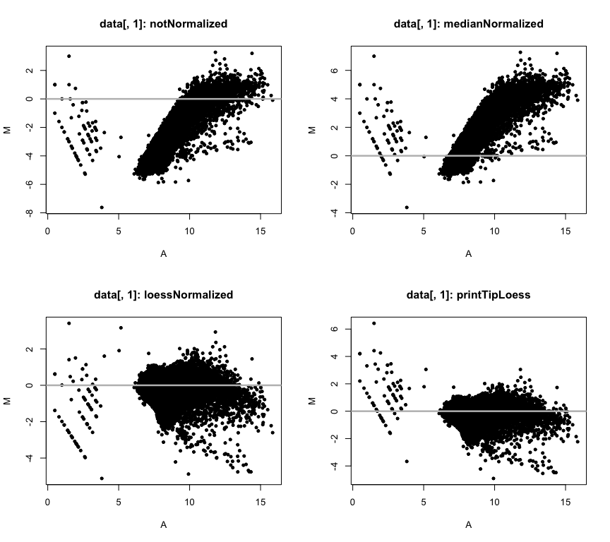
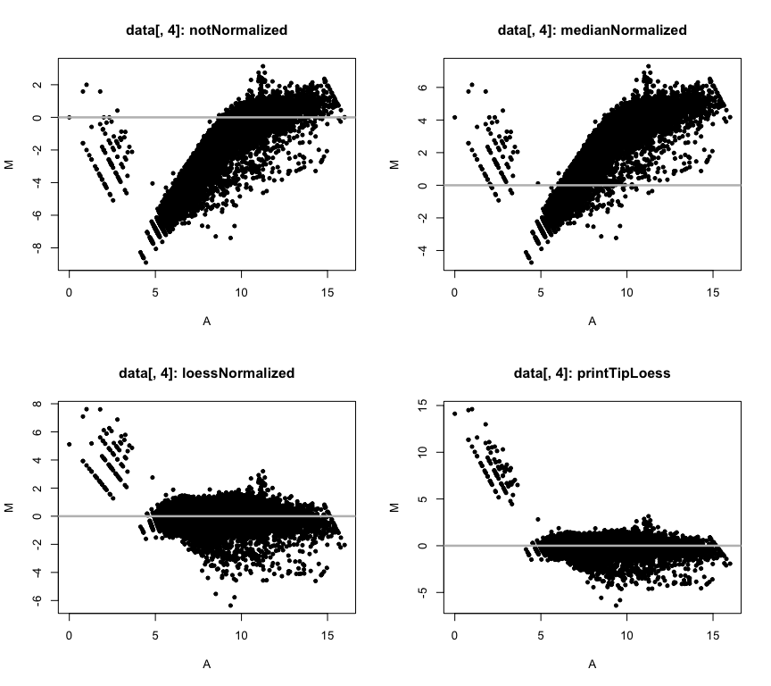

------------------------------------------------------------------------

#### For this assignment, we will be evaluating different normalization methods on 2-channel arrays in which 4 biological samples were run. The study is from GEO and the description of the experiment is provided as follows.

> **Series GSE12050**: Subcutaneous adipose tissue from lean and obese subjects ([source][1]).

#### Obtaining adipose tissue samples are paramount to the understanding of human obesity. We have examined the impact of needle-aspirated and surgical biopsy techniques on the study of subcutaneous adipose tissue (scAT) gene expression in both obese and lean subjects. Biopsy sampling methods have a significant impact on data interpretation and revealed that gene expression profiles derived from surgical tissue biopsies better capture the significant changes in molecular pathways associated with obesity. We hypothesize that this is because needle biopsies do not aspirate the fibrotic fraction of scAT; which subsequently results in an under-representation of the inflammatory and metabolic changes that coincide with obesity. This analysis revealed that the biopsy technique influences the gene expression underlying the biological themes commonly discussed in obesity (e.g. inflammation, extracellular matrix, metabolism, etc), and is therefore a caveat to consider when designing microarray experiments. These results have crucial implications for the clinical and physiopathological understanding of human obesity and therapeutic approaches. We will be working with 4 lean subjects from which a needle biopsy was taken.

------------------------------------------------------------------------
  
#### **1.) First load the marray library, then load the 4 GenePix files, making sure to extract the foreground and background median values from the Cy5 and Cy3 channels.**  
  

```r
suppressPackageStartupMessages(library(marray))
```
  
First we need to decompress the `GSE12050_amend.zip` dataset downloaded into the "data" directory.
   

```r
dir(path = "data")
```

```
## [1] "gp"                       "GSE12050_amend.zip"      
## [3] "Inflammation_qRT-PCR.csv" "out.fi"                  
## [5] "qRT-PCR.csv"
```

```r
# Unzip/gunzip the GSE files
system(command = "unzip -o data/GSE12050_amend.zip -d data/gp; gunzip -q data/gp/*")

# Move to folder containing .gpr files
cwd <- getwd() # store root
setwd("data/gp")

# Load data into R
data <- read.GenePix()
```

```
## Reading ...  GSM304445.gpr 
## Reading ...  GSM304446.gpr 
## Reading ...  GSM304447.gpr 
## Reading ...  GSM304448.gpr
```

```r
# Move back to root
setwd(cwd)
```
  
#### **2.) Normalize each array using median global, loess, and print-tip-group loess methods. Then plot MvA plots of all 4 arrays comparing no normalization to the other 3 normalization approaches.**
  

```r
# Load saved script (see function at end of document)
source("scripts/norm_and_plot.R")

# Run function on all arrays
norm_and_plot(data[, 1])
```



```r
norm_and_plot(data[, 2])
```


```r
norm_and_plot(data[, 3])
```


```r
norm_and_plot(data[, 4])
```


  
#### **3.) Plot density plots of the log ratio values for each normalization (and pre normalization) for only array #4. Put them all on the same plot. Make sure to label the axes and provide a legend.**
  

```r
# Save array4 normalized to variable
array4 <- norm_and_plot(data[, 4], plot = FALSE)

# Save density calculations
d1 <- density(maM(array4[[1]]), na.rm = TRUE) # none
d2 <- density(maM(array4[[2]]), na.rm = TRUE) # median
d3 <- density(maM(array4[[3]]), na.rm = TRUE) # loess
d4 <- density(maM(array4[[4]]), na.rm = TRUE) # printiploess

# Plot ranges
par(lwd = 3, font.lab = 2)
plot(
    x = range(d1$x, d2$x, d3$x, d4$x),
    y = range(d1$y, d2$y, d3$y, d4$y),
    type = "n",
    ylab = "Density",
    xlab = "Log-ratios",
    main = "Density plot"
)
# Density plots
lines(d1, col = "magenta")
lines(d2, col = "cyan")
lines(d3, col = "red")
lines(d4, col = "green", lty = 3) # dotted overlapped easier to see
legend(
    "topright",
    legend = labels(array4),
    lty = c(1, 1, 1, 3), 
    col = c("magenta", "cyan", "red", "green"),
    inset = 0.02, cex = 0.7, text.font = 2
)
```


  
#### **4.) Based on the plots generated so far, which normalization do you think is most preferred for this dataset?**
  
For this data set, it appears either the "within-print-tip-group intensity dependent location normalization" (printTipLoess) or the "global intensity or A-dependent location normalization" (loess) methods work *equally* well.
  
#### **5.) Research has demonstrated that often a single channel, background subtracted provides as good a normalization as using both channels. To test this, we will be utilizing the fact that these 4 samples are replicates and calculate the correlation between them. So, first extract the Cy5 foreground and background values for each of the 4 arrays and subtract the background from the foreground values, then log2 transform these values. Then calculate global median normalization on these 4 arrays using these background subtracted Cy5 values. Hint, you need to use the median of each array to scale, such that after normalization, all arrays will have a median of 1.**
  

```r
Rf <- maRf(data) # Cy5 fg
Rb <- maRb(data) # Cy5 bg

# Subtract bg from fg
R <- Rf - Rb 

# Log2 transform
log2R <- log2(R)

# Calculate c = log2(k)
c <- apply(log2R, 2, median, na.rm = TRUE)

# Subtract the vector from each row
mnorm.log2R <- t(apply(log2R, 1, function(x) x - c))

# Verify the median is log2(1) = 0
apply(mnorm.log2R, 2, median, na.rm = TRUE)
```

```
## GSM304445.gpr GSM304446.gpr GSM304447.gpr GSM304448.gpr 
##             0             0             0             0
```
  
#### **6.) Next calculate a Spearman’s rank correlation between all 4 arrays that you normalized in #5 and do the same with the M values from loess normalized data that you generated in #2. Plot a scatter plot matrix for each of the two normalizations (pairs() function), and be sure to label the arrays and title the plot. Print the correlation coefficients to the screen.**
  

```r
# Single channel median norm correlation
corr.mnorm <- round(cor(mnorm.log2R,
                   use = "complete.obs",
                   method = "spearman"), 3)
pairs(
  x = corr.mnorm,
  las = 2, pch = 19,
  upper.panel = NULL,
  col = "green",
  main = "Single Channel, Global Median Normalized"
)
```


```r
# Two channel loess norm correlation
corr.loess <- round(cor(maM(maNorm(data, norm = "loess")),
                   use = "complete.obs",
                   method = "spearman"), 3)
pairs(
  x = corr.loess,
  las = 2, pch = 19,
  labels = gsub(pattern = "data.gp.", replacement = "", colnames(corr.loess)),
  upper.panel = NULL,
  col = "red",
  main = "Two Channel, Loess Normalized"
)
```


```r
# Print correlation coefficients
corr.mnorm
```

```
##               GSM304445.gpr GSM304446.gpr GSM304447.gpr GSM304448.gpr
## GSM304445.gpr         1.000         0.896         0.878         0.899
## GSM304446.gpr         0.896         1.000         0.876         0.908
## GSM304447.gpr         0.878         0.876         1.000         0.885
## GSM304448.gpr         0.899         0.908         0.885         1.000
```

```r
corr.loess
```

```
##               GSM304445.gpr GSM304446.gpr GSM304447.gpr GSM304448.gpr
## GSM304445.gpr         1.000         0.690         0.752         0.691
## GSM304446.gpr         0.690         1.000         0.722         0.702
## GSM304447.gpr         0.752         0.722         1.000         0.745
## GSM304448.gpr         0.691         0.702         0.745         1.000
```
  
#### **7.) Now we want to compare these normalizations to quantile normalized data to see if we gain anything by leveraging the distributions across all 4 arrays. Carry out the steps in the lecture or use the paper from Bolstad et al. entitled: “A comparison of normalization methods for high density oligonucleotide array data based on variance and bias” (on the course website), but we are only going to conduct this on the Cy5 channel. The basic steps are as follows (these 6 steps are calculated on non-logged data; the data is logged after these steps are carried out):**
  

```r
# 1. Subtract the foreground – background for each of the 4 chips for only the Cy5 channel. This should all be on the linear or raw scale (no logging yet).
dat <- data.frame(maRf(data) - maRb(data))

# 2. Sort each column independently in this new matrix
dat.sorted <- data.frame(apply(dat, 2, sort))

# 3. Calculate row means for the sorted matrix
dat.sorted.mean <- apply(dat.sorted, 1, mean)

# 4. Create a new matrix with each row having the same values as the sorted row mean vectors from step #3 (you should have a new R matrix)
mean_matrix <- matrix(dat.sorted.mean, nrow = length(dat.sorted.mean), ncol = 4, byrow = FALSE)

# 5. Rank the columns independently on the original background subtracted matrix (from step #1) Hint: use the `rank()` function with the argument `ties=”first”` or `order()`
dat.ranked <- apply(dat, 2, rank, ties.method = "first")

# 6. Reorder the columns in the new matrix from step #4 using the ranks from step #5
quant.norm <- apply(dat.ranked, 2, function (x) dat.sorted.mean[x])
```
  
**To verify that each array has the same distribution, use the `hist()` function to look at various arrays (e.g., `hist(c5.norm[,1])`; `hist(c5.norm[,2])`; etc.). Slight differences in distributions are a result of the ties in the ranking.**
  

```r
# Graph parameters
par(mfrow = c(2,2))
cols = c("salmon", "lightgreen", "lightblue", "mediumpurple1")

# Plot each as log-transformed (data is skewed left)
for (i in seq_len(ncol(quant.norm))) {
    hist(x=log2(quant.norm[,i]), breaks=30,
         xlab = bquote(log[2]~(dat[norm]) ~ Array ~ .(i)),
         main = bquote("Histogram of Normalized Array" ~ .(i)),
         col = cols[i])
    box()
}
```


  
#### **8.) Now log (base 2) the new R matrix you created from step 6 (question #7) and calculate a Spearman’s rank correlation between the 4 arrays and plot a scatter plot matrix as you did before. Print the correlation coefficients to the screen.**
  

```r
# 7. Finally, we can log the data:
log.quant.norm <- data.frame(log2(quant.norm))

# Calculate Spearman’s rank correlation
corr.lqn <- round(cor(log.quant.norm, method = "spearman", use = "complete.obs"), 3)

# Scatter plot matrix
pairs(
  x = corr.lqn,
  las = 2, pch = 19,
  labels = gsub(pattern = "data.gp.", replacement = "", colnames(corr.lqn)),
  upper.panel = NULL,
  col = "red",
  main = "Red Channel, Quantile Normalized"
)
```


```r
# Print correlation coefficients
corr.lqn
```

```
##               GSM304445.gpr GSM304446.gpr GSM304447.gpr GSM304448.gpr
## GSM304445.gpr         1.000         0.895         0.878         0.898
## GSM304446.gpr         0.895         1.000         0.877         0.907
## GSM304447.gpr         0.878         0.877         1.000         0.884
## GSM304448.gpr         0.898         0.907         0.884         1.000
```
  
#### **9.) Of the 4 normalization methods, which do you suggest as optimal and why?**
  

#### **10.) Now we want to work with a qRT-PCR dataset from patients with an inflammatory disease. The genes measured for this experiment included a set of proinflammatory chemokines and cytokines that are related to the disease. Download the raw qRT-PCR file called Inflammation_qRT-PCR.csv. Then change the normalization script from the lecture notes to include the housekeeping genes beta actin, GAPDH, and 18S. Look at the file to make sure the housekeepers are spelled correctly. Run the normalization script and output a data matrix of fold change values.**
  

```r
# Load script containing function into environment
source("scripts/f.parse.R")

# Set arguments 
pa <- "data/"
fi <- "Inflammation_qRT-PCR.csv"
out.fi <- "out.fi"

# Run loaded function
f.parse(pa, fi, out.fi)
```

```
## [1] "1: 434_1"
## [1] "2: 434_15"
## [1] "3: 434_2"
## [1] "4: 434_14"
## [1] "5: 434_3"
## [1] "6: 434_13"
## [1] "7: 434_4"
## [1] "8: 434_12"
## [1] "9: 434_5"
## [1] "10: 434_11"
## [1] "11: 434_6"
## [1] "12: 434_10"
## [1] "13: 434_7"
## [1] "14: 434_9"
## [1] "15: 434_8"
```
  
#### **11.) Read the normalized qRT-PCR data matrix into R, using a Spearman’s rank correlation, which two patients are most correlated? Plot these two patients against each other in a scatter plot.**
  

```r
# Read data into R, transpose to make patients as columns
norm.dat <- read.table("data/out.fi",
                       header = TRUE,
                       row.names = 1,
                       sep = "\t")

# Correlation of quantile normalized qRT-PCR data
(corr.norm.dat <- round(cor(t(norm.dat)[, -(1)], method = "spearman", use = "complete.obs"),3))
```

```
##        434_15  434_2 434_14  434_3 434_13  434_4 434_12  434_5 434_11  434_6
## 434_15  1.000 -0.311 -0.024 -0.176 -0.077 -0.167  0.035 -0.294  0.150 -0.106
## 434_2  -0.311  1.000  0.534  0.033  0.113 -0.181 -0.197  0.302 -0.116  0.001
## 434_14 -0.024  0.534  1.000  0.026 -0.019 -0.209 -0.069  0.423  0.034  0.101
## 434_3  -0.176  0.033  0.026  1.000  0.391  0.928  0.851  0.676  0.802  0.845
## 434_13 -0.077  0.113 -0.019  0.391  1.000  0.367  0.451  0.276  0.477  0.363
## 434_4  -0.167 -0.181 -0.209  0.928  0.367  1.000  0.825  0.601  0.743  0.852
## 434_12  0.035 -0.197 -0.069  0.851  0.451  0.825  1.000  0.484  0.928  0.713
## 434_5  -0.294  0.302  0.423  0.676  0.276  0.601  0.484  1.000  0.471  0.797
## 434_11  0.150 -0.116  0.034  0.802  0.477  0.743  0.928  0.471  1.000  0.686
## 434_6  -0.106  0.001  0.101  0.845  0.363  0.852  0.713  0.797  0.686  1.000
## 434_10 -0.116 -0.184 -0.225  0.781  0.356  0.853  0.662  0.550  0.592  0.851
## 434_7  -0.141 -0.050  0.045  0.878  0.367  0.900  0.751  0.718  0.747  0.949
## 434_9   0.377 -0.001  0.139  0.175  0.272  0.038  0.327 -0.092  0.429  0.002
## 434_8  -0.238 -0.026 -0.052  0.969  0.377  0.940  0.853  0.632  0.787  0.805
##        434_10  434_7  434_9  434_8
## 434_15 -0.116 -0.141  0.377 -0.238
## 434_2  -0.184 -0.050 -0.001 -0.026
## 434_14 -0.225  0.045  0.139 -0.052
## 434_3   0.781  0.878  0.175  0.969
## 434_13  0.356  0.367  0.272  0.377
## 434_4   0.853  0.900  0.038  0.940
## 434_12  0.662  0.751  0.327  0.853
## 434_5   0.550  0.718 -0.092  0.632
## 434_11  0.592  0.747  0.429  0.787
## 434_6   0.851  0.949  0.002  0.805
## 434_10  1.000  0.866  0.092  0.787
## 434_7   0.866  1.000  0.083  0.879
## 434_9   0.092  0.083  1.000  0.155
## 434_8   0.787  0.879  0.155  1.000
```

```r
# Load pairs plot panel function
source("scripts/px.R")

# Pairs plot, cut out non-varying column (Fold change = 1)
pairs(corr.norm.dat[,-(1)],
      upper.panel = NULL,
      col = "darkgreen",
      pch = 19, panel = px,
      main = "Correlation Matrix: All patients")
```


  
There's a lot of data on this chart. To quickly find the pair with the highest correlation, we grab the second maximum value out of *each* column in the correlation matrix (since the first maximum will be 1), then sort the resulting vector and note the top two from there. See below.
  

```r
# First sort matrix by column and grab the 2nd max value from each column
max_corr <- apply(corr.norm.dat, 2, function (x) sort(x, decreasing = TRUE)[2])

# Then, sort the vector from before and note the first two (x & y)
sort(max_corr, decreasing = TRUE)
```

```
##  434_3  434_8  434_6  434_7  434_4 434_12 434_11 434_10  434_5  434_2 434_14 
##  0.969  0.969  0.949  0.949  0.940  0.928  0.928  0.866  0.797  0.534  0.534 
## 434_13  434_9 434_15 
##  0.477  0.429  0.377
```
  
It appears that **patient 434_3** and patient **434_8** are *most* correlated.
  

```r
par(lwd = 2, font = 2)
plot(
  corr.norm.dat["434_8", ] ~ corr.norm.dat["434_3", ],
  xlab = "Patient 434_3",
  ylab = "Patient 434_8",
  pch = 19, col = "darkgreen",
  main = "Scatterplot: Patient 434_8 vs. Patient 434_3",
  font = 2, lwd = 2
)

# Linear model
lm <- lm(corr.norm.dat["434_8",] ~ corr.norm.dat["434_3",])
abline(lm, col = "red")
lab <- parse(text = sprintf('R^2 == %s', round(summary(lm)$r.squared, 3)))
legend(
  "bottomright",
  legend = c("Linear model", lab),
  col = c("red", NULL),
  lty = c(1, 0),
  inset = 0.02
)
```


\newpage
## Functions sourced
  

```r
# Function which normalizes and plots MvA for an array
norm_and_plot
```

```
## function (array, plot = TRUE) 
## {
##     norms <- list(notNormalized = maNorm(array, norm = "n"), 
##         medianNormalized = maNorm(array, norm = "m"), loessNormalized = maNorm(array, 
##             norm = "l"), printTipLoess = maNorm(array, norm = "p"))
##     if (plot) {
##         par(mfrow = c(2, 2))
##         for (i in seq_along(norms)) {
##             d.method <- names(norms)[i]
##             d.name <- deparse(substitute(array))
##             maPlot(m = norms[[i]], lines.func = NULL, legend.func = NULL, 
##                 main = paste(d.name, d.method, sep = ": "))
##         }
##     }
##     else {
##         return(norms)
##     }
## }
## <bytecode: 0x7fca022626a0>
```

```r
# Function used to get fold change of qRT-PCR data
f.parse
```

```
## function (path = pa, file = fi, out = out.fi) 
## {
##     d <- read.table(paste(path, file, sep = ""), skip = 11, sep = ",", 
##         header = T)
##     u <- as.character(unique(d$Name))
##     u <- u[u != ""]
##     u <- u[!is.na(u)]
##     ref <- unique(as.character(d$Name[d$Type == "Reference"]))
##     u <- unique(c(ref, u))
##     hg <- c("B-ACTIN", "GAPDH", "18S")
##     hg <- toupper(hg)
##     p <- unique(toupper(as.character(d$Name.1)))
##     p <- sort(setdiff(p, c("", hg)))
##     mat <- matrix(0, nrow = length(u), ncol = length(p))
##     dimnames(mat) <- list(u, p)
##     for (i in 1:length(u)) {
##         print(paste(i, ": ", u[i], sep = ""))
##         tmp <- d[d$Name %in% u[i], c(1:3, 6, 9)]
##         g <- toupper(unique(as.character(tmp$Name.1)))
##         g <- sort(setdiff(g, c("", hg)))
##         for (j in 1:length(g)) {
##             v <- tmp[toupper(as.character(tmp$Name.1)) %in% g[j], 
##                 5]
##             v <- v[v != 999]
##             v <- v[((v/mean(v)) < 1.5) & ((v/mean(v)) > 0.67)]
##             hv3 <- NULL
##             for (k in 1:length(hg)) {
##                 hv <- tmp[toupper(as.character(tmp$Name.1)) %in% 
##                   hg[k], 5]
##                 hv <- hv[hv != 999]
##                 hv3 <- c(hv3, hv[((hv/mean(hv)) < 1.5) & ((hv/mean(hv)) > 
##                   0.67)])
##             }
##             sv <- mean(as.numeric(v)) - mean(as.numeric(hv3))
##             if (i == 1) {
##                 mat[u[i], g[j]] <- sv
##                 next
##             }
##             mat[u[i], g[j]] <- sv - mat[u[1], g[j]]
##         }
##     }
##     mat[1, ][!is.na(mat[1, ])] <- 0
##     fc <- 2^(-1 * mat)
##     write.table(t(c("Subject", dimnames(mat)[[2]])), paste(path, 
##         out, sep = ""), quote = F, sep = "\t", col.names = F, 
##         row.names = F)
##     write.table(round(fc, 3), paste(path, out, sep = ""), quote = F, 
##         sep = "\t", append = T, col.names = F)
## }
## <bytecode: 0x7fca02323cb8>
```

```r
# Function used in panel plot matrix
px
```

```
## function (x, y, col = par("col"), pch = par("pch"), lm.col = "red", 
##     ...) 
## {
##     points(x, y, pch = pch, col = col, ...)
##     abline(0, 1, col = lm.col)
## }
## <bytecode: 0x7fca015dd678>
```

\newpage
## Session Info
  

```r
sessionInfo()
```

```
## R version 4.1.0 (2021-05-18)
## Platform: x86_64-apple-darwin17.0 (64-bit)
## Running under: macOS Big Sur 10.16
## 
## Matrix products: default
## BLAS:   /Library/Frameworks/R.framework/Versions/4.1/Resources/lib/libRblas.dylib
## LAPACK: /Library/Frameworks/R.framework/Versions/4.1/Resources/lib/libRlapack.dylib
## 
## locale:
## [1] en_US.UTF-8/en_US.UTF-8/en_US.UTF-8/C/en_US.UTF-8/en_US.UTF-8
## 
## attached base packages:
## [1] stats     graphics  grDevices utils     datasets  methods   base     
## 
## other attached packages:
## [1] marray_1.70.0 limma_3.48.1 
## 
## loaded via a namespace (and not attached):
##  [1] digest_0.6.27     R6_2.5.0          jsonlite_1.7.2    magrittr_2.0.1   
##  [5] evaluate_0.14     highr_0.9         rlang_0.4.11      stringi_1.6.2    
##  [9] jquerylib_0.1.4   bslib_0.2.5.1     rmarkdown_2.9     tools_4.1.0      
## [13] stringr_1.4.0     xfun_0.24         yaml_2.2.1        compiler_4.1.0   
## [17] htmltools_0.5.1.1 knitr_1.33        sass_0.4.0
```

[1]: https://www.ncbi.nlm.nih.gov/geo/query/acc.cgi?acc=GSE12050
