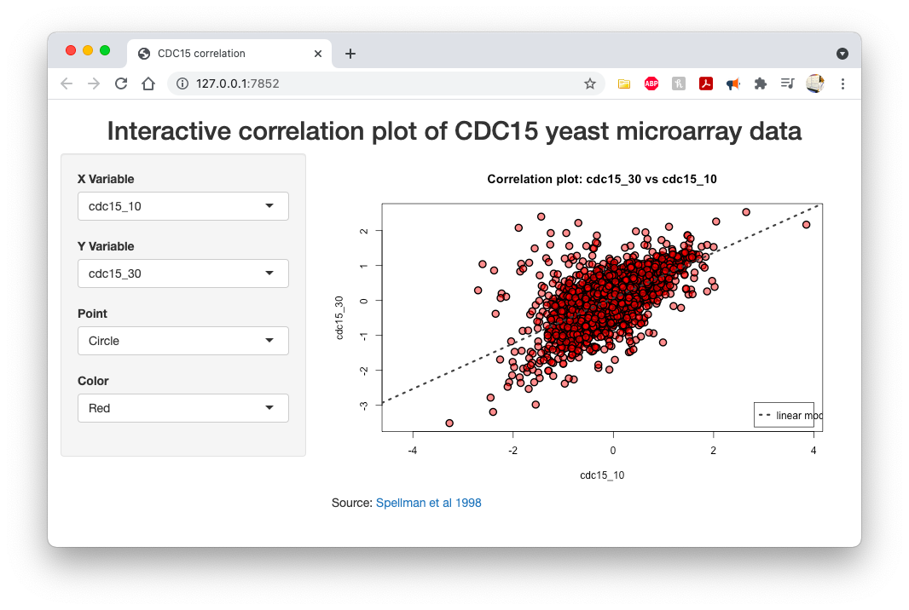

```{r setup, include=FALSE}
# knitr options
knitr::opts_chunk$set(
    echo = TRUE,
    fig.align = "center"
)

# clear out the environment
rm(list = ls())
system(command = "rm -f spellman.txt ryancey3-gedav-lab2.pdf")
```

------------------------------------------------------------------------

#### In this lab, we are going to work with a very popular time course cDNA data set from Paul Spellman’s lab at Stanford. This microarray was designed with probes from the yeast Saccharomyces cerevisiae genome. The data set includes 3 different experiments, each with its own time course (each array is a different time point) for measuring transcript levels that are induced by various cyclins. The transcripts that respond to this stimulus are seen to be regulated at the different stages of the cell cycle. The 3 experiments differ by the method that the yeast cultures were synchronized: alpha factor arrest, elutriation, and arrest of a cdc15 temperature-sensitive mutant. The cdc15 time course experiment is the one that we will use in this lab to conduct some simple mathematical manipulations and plots.

#### The paper, *Comprehensive Identification of Cell Cycle–regulated Genes of the Yeast Saccharomyces cerevisiae by Microarray Hybridization* is available [here][1].

------------------------------------------------------------------------

> **ABSTRACT** We sought to create a comprehensive catalog of yeast genes whose transcript levels vary periodically within the cell cycle. To this end, we used DNA microarrays and samples from yeast cultures synchronized by three independent methods: alpha factor arrest, elutriation, and arrest of a cdc15 temperature-sensitive mutant. Using periodicity and correlation algorithms, we identified 800 genes that meet an objective minimum criterion for cell cycle regulation. In separate experiments, designed to examine the effects of inducing either the G1 cyclin Cln3p or the B-type cyclin Clb2p, we found that the mRNA levels of more than half of these 800 genes respond to one or both of these cyclins. Furthermore, we analyzed our set of cell cycle–regulated genes for known and new promoter elements and show that several known elements (or variations thereof) contain information predictive of cell cycle regulation. A full description and complete data sets are available at [http://cellcycle-www.stanford.edu][2]

------------------------------------------------------------------------
#### **1) Go to class website under Course Documents > Data Sets and download the Spellman yeast cell cycle dataset zip file.** \
\
Done. Downloaded as **"`r grep("spellman", dir(), value = TRUE)`"** in the project working directory.\
\newpage

#### **2) Unzip the text file, and read into R (Hint: using the read.table() function with a “header=T” argument and “row.names=1” argument is one method to do this).** \
\
After downloading, we have `spellman.zip` in our current directory. We need to extract the ZIP file contents prior to uploading into our environment.

```{r unzip data}
# see files in current directory
(pre_unzip <- dir())

# extract using system command
system(command = "unzip -o spellman.zip")
```

Next, we can check the extracted file name and upload that new file into R.

```{r load data}
# check files to see extraction was successful
(post_unzip <- dir())

# load "spellman.txt" with headers and row names specified
spellman <- read.table(file = setdiff(post_unzip, pre_unzip),
                       header = TRUE,
                       row.names = 1)
```


#### **3) Look at the dimensions of the data frame and make sure that there are 6,178 genes and 77 arrays/sample.** \
\
We'll look at the dimensions using the `dim()` function.\
```{r dimensions}
# view dimensions of data
dim(spellman)
```
There are **`r dim(spellman)[1]`** genes (rows) and **`r dim(spellman)[2]`** samples (columns) in the `spellman` data set.\

\newpage

#### **4) Isolate only the cdc15 experiment (samples 23-46).** \
\
To do so, use `grepl()` to obtain a vector of columns which contain the "cdc15" prefix and subset based on that result.\
```{r subset cdc15}
# subset cdc15 experiments
expt <- grepl("^cdc15", colnames(spellman))

# note, we could also use:
# cdc15 <- spellman[, 23:46]
cdc15 <- spellman[, expt]

# view dimensions
dim(cdc15)
```
We still have **`r dim(cdc15)[1]`** genes in **`cdc15`**, but the samples have been limited to the **`r dim(cdc15)[2]`** experimental samples using the *Saccharomyces cerevisiae cdc15-2* strain.\


#### **5) Now calculate a correlation matrix between the time points (use Pearson’s correlation). Make sure to title the plot, label the axes, and provide a legend of the color gradient. In the correlation calculation, make sure to use the argument ‘use’ and value=pairwise.complete.obs since all of these arrays have at least one missing value.** \
\
We need to calculate a correlation matrix before we can plot them using the `image()` function in R to visualize the output as a heatmap.\
```{r correlation matrix}
# correlation function with the correct "use" statement.
# note: pearson is the default method
spellman.cor <- cor(cdc15, use = "pairwise.complete.obs")
```

Now, we'll build up to creating our final plot with a few preparation steps.

1. Set custom layout of plots (heatmap and legend)
2. Set margins for graphs
3. Create heatmap color palette
4. **Plot heatmap**
5. Overlay y-axis and x-axis
6. **Plot color legend**
7. Overlay y-axis and box around legend
8. Add title for the whole plot

\newpage

```{r heatmap, message=FALSE}
# set custom layout of plots (heatmap and legend)
layout(matrix(c(1, 1, 1, 1, 1, 1, 1, 1, 1, 0, 2, 2), 3, 4, byrow = FALSE), widths = c(3, 1))
# set margins for graphs
par(oma = c(2, 3, 1, 3))

# create heatmap color palette
cols <- colorRampPalette(c("green", "yellow" ,"red"))(100)

# plot heatmap
image(spellman.cor, col = cols, axes = FALSE)
# overlay axes
axis(
    side = 2, # y-axis
    at = seq(0, 1, length = ncol(spellman.cor)),
    labels = colnames(spellman.cor),
    las = 2,
    cex = 0.9
)
axis(
    side = 1, # x-axis
    at = seq(0, 1, length = ncol(spellman.cor)),
    labels = colnames(spellman.cor),
    las = 2,
    cex = 0.9
)

# generate color legend vector
legend <- seq(min(spellman.cor, na.rm = TRUE),
              max(spellman.cor, na.rm = TRUE),
              length = 500)
# plot color legend
image(t(as.matrix(legend)),
      col = cols,
      axes = FALSE,
      main = "Legend")
# add y-axis on right side of legend
axis(
    side = 4,
    at = seq(0, 1, length = 7),
    labels = round(seq(min(legend), max(legend), length = 7), 3),
    las = 2
)
# add rectangle around legend
box()

# title for figure
title(
    main = "Pearson's correlation plot:
    VPS28 Expression in CDC15 mutant yeast over 290 minutes",
    outer = TRUE,
    line = -3,
    cex.main = 1.75
)
```

\newpage

#### **6) Select the gene YAL002W, which is VPS8, a membrane-binding component of the CORVET complex; involved in endosomal veiscle tethering and fusion in the endosome to vacuole protein targeting pathway. Impute the missing values with the row mean (save as something). Make sure to cast the gene to numeric.** \
\
First we need to isolate the YAL002W row and determine how many samples have `NA` values using `sum()` paired with `is.na()`.\
```{r deal with missing data 1}
# isolate x & y vars
VPS8 <- as.numeric(cdc15["YAL002W", ])

# how many NAs are there?
sum(is.na(VPS8))
```
There are **`r sum(is.na(VPS8))` `NA` values** in this row. We'll handle them using `sapply()` where we define an `ifelse()` function to replace the `NA` values with the row mean. Then, we'll verify they're removed using `sum()` and `is.na()` again.\
```{r deal with missing data 2}
# calculate the row mean
rowmean <- mean(VPS8, na.rm = TRUE)

# impute the missing values with the row mean
VPS8.NAs.imputed <- sapply(VPS8, function(x) ifelse(is.na(x), rowmean, x))

# verify all NAs are replaced
sum(is.na(VPS8.NAs.imputed))
```
Now, there are **`r sum(is.na(VPS8.NAs.imputed))` `NA`** values in the row.\

\newpage

#### **7) Generate a profile plot of the same gene. Title the plot, label the axes, and on the x-axis, provide the time points only for each array (no “cdc15_” prefix) so we can visualize the transcript pattern over time. Use `lwd` in the plot command (`lwd` = line width).** \
\
We can extract the time points simply by using `sub()` with "cdc15_" as the pattern and a blank as the replacement. Then, we'll plot the gene expression profile.\
```{r gene profile}
# set graph parameters back to defaults
par(oma = rep(0, 4))
layout(1)

# remove prefix from colnames using sub
times <- as.numeric(sub("cdc15_", "", colnames(cdc15)))

# plot gene expression profile
plot(
    main = expression(bold("VPS8 gene expression in "
                           *bolditalic("S. cerevisiae cdc15")*
                               " over 290 minutes")),
    x = times,
    xlab = "Time",
    y = VPS8.NAs.imputed,
    ylab = "VPS8 (YAL002W) Expression",
    type = "l",
    las = 1, 
    lwd = 2, # required lwd command
    col = "#73BA9B"
)

# add points to see where measurements were taken
points(x = times,
       y = VPS8.NAs.imputed,
       pch = 18,
       col = "#536271")

legend("topleft", legend = "Measurement", pch = 18, col = "#536271", inset = 0.05)
```

\newpage

#### **8)  Now let’s create a simple shiny app which allows the user to select and correlate any time point verse another time point across all genes. To do this, we can create a server and ui function within the same file, paste both into the R session, then call them with:** \
\
```{r, eval = FALSE}
shiny::shinyApp(ui = ui, server = server)
```

#### **Use the Iris dataset example from the lecture as a model. You can remove the kmeans clustering code and just focus on plotting the columns (time points) of the CDC15 data matrix against each other.** \
\
**NOTE**: this code is not functional in the current document. Proceed [HERE][3] to use the running version, or run the following command in R (only works if `app.R` is in the working directory):\
```{r, eval = FALSE}
shiny::runApp("app.R")
```

Here is the source code for `app.R`:\
```{r shiny app, eval = FALSE}
# load necessary libraries
library("shiny")
library("shinythemes")
library("htmltools")

# load in the data with headers and row names specified
spellman <- read.table(file = "spellman.txt",
                       header = TRUE,
                       row.names = 1)

# subset the cdc15 experiment
expt <- grepl("^cdc15", colnames(spellman))
cdc15 <- spellman[, expt]

# Define UI logic
ui <- fluidPage(theme = "lumen",
                titlePanel(
                    h2(
                        tagList("Interactive correlation plot of CDC15 yeast microarray data"),
                        align = "center"
                    ), windowTitle = "CDC15 correlation"
                ),
                sidebarLayout(
                    sidebarPanel(
                        # choice 1
                        selectInput(
                            inputId = 'xcol',
                            label = "X Variable",
                            choices = colnames(cdc15),
                            selected = colnames(cdc15)[1]
                        ),
                        # choice 2
                        selectInput(
                            inputId = 'ycol',
                            label = "Y Variable",
                            choices = colnames(cdc15),
                            selected = colnames(cdc15)[2]
                        ),
                        # point type choice
                        selectInput(
                            inputId = "pch",
                            label = "Point",
                            choices = c(
                                "Circle" = 21,
                                "Square" = 22,
                                "Diamond" = 23,
                                "Triangle" = 24
                            )
                        ),
                        # point color choice
                        selectInput(
                            inputId = "col",
                            label = "Color",
                            choices = c(
                                "Red" = "red",
                                "Orange" = "orange",
                                "Yellow" = "yellow",
                                "Green" = "green",
                                "Blue" = "blue",
                                "Purple" = "purple"
                            )
                        )
                    ),
                    # main panel correlation plot
                    mainPanel(plotOutput(outputId = 'xyplot'),
                              tagList("Source: ", tags$a(href = "https://www.molbiolcell.org/doi/pdf/10.1091/mbc.9.12.3273", "Spellman et al 1998")))
                ))

# Define server logic
server <- function(input, output) {
    # selected columns
    selected_data <- reactive({
        cdc15[, c(input$xcol, input$ycol)]
    })
    
    # selected color
    selected_color <- reactive({
        rgb(t(col2rgb(input$col)),
            alpha = (255 / 2),
            maxColorValue = 255)
    })
    
    # selected point
    selected_pch <- reactive({
        as.numeric(input$pch)
    })
    
    # plot
    output$xyplot <- renderPlot({
        # xy plot
        plot(
            selected_data(),
            type = "p",
            col = "black",
            bg = selected_color(),
            pch = selected_pch(),
            lwd = 2,
            cex = 1.5
        )
        # title
        title(paste(
            "Correlation plot:",
            colnames(selected_data())[2],
            "vs",
            colnames(selected_data())[1]
        ))
        # linear model
        abline(
            lm(selected_data()[, 2] ~ selected_data()[, 1]),
            lwd = 3,
            lty = 3,
            col = "gray25"
        )
        # legend
        legend(
            "bottomright",
            legend = "linear model",
            lwd = 3,
            lty = 3,
            xjust = 0.5,
            col = "gray25",
            inset = 0.02
        )
    })
    
}

# create Shiny app object
shinyApp(ui = ui, server = server)
```

\newpage
#### For reference, here is a screenshot of the final web-page:
\



[1]: https://www.molbiolcell.org/doi/pdf/10.1091/mbc.9.12.3273
[2]: http://genome-www.stanford.edu/cellcycle/
[3]: https://ryanyancey.shinyapps.io/gedav-lab2/