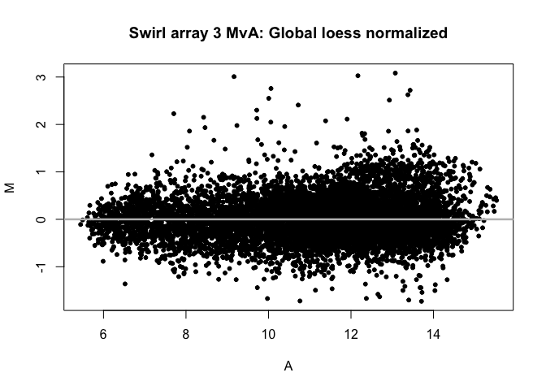

------------------------------------------------------------------------

#### In this lab, we will be working with a few data sets, each run on a different platform. The first data set is an R object generated from a 2-channel cDNA array that is called `swirl`. This data set is an experiment that was run on a zebrafish to study the early development. The data is named such because “swirl is a point mutant in the BMP2 gene that affects the dorsal/ventral body axis.” The objective of the experiment was to evaluate the transcript differences between wildtype zebrafish and those with this mutation. As I mentioned above, swirl is an R object, so the format and structure of this binary file has to be accessed through various R functions. If you type `swirl`, you will immediately see that there are attributes that make up this file (e.g. `@maInfo`) beyond the typical channel information. Included is metadata information that makes up the experimental parameters, in addition to the raw intensity data.

#### The second 2 data sets are raw intensity files – one from an Agilent platform and the other from an Affymetrix platform. Both of these files are on the course website. These are not R objects, rather the Agilent files are raw text files generated from the Agilent software and the Affymetrix files are raw binary files generated from the Affymetrix software.

#### Since both R objects and raw data files are typically what an analyst is given when asked to analyze an experiment, this lab will give you experience processing raw intensity files and normalizing them appropriately. This is typically the first step in conducting any microarray analysis, so it is important to make sure that the data is normalized appropriately before beginning any subsequent steps.

------------------------------------------------------------------------
\newpage
**1.) Load the `marray` library and the `swirl` data set. This data set is an R metadata object, so there are multiple pieces of information (e.g., red/green background and foreground intensities, chip layout design, etc.) that are stored in this R data object.**\


```r
# Load the marray library and the swirl data set
suppressPackageStartupMessages(library("marray"))
data("swirl")
```
\
**2.) Plot an MvA plot of array 3 without any stratified lines.**\


```r
# store array 3 in a variable for easier use
array3 <- swirl[, 3]

# plot MvA -- no stratified lines
maPlot(array3,
       lines.func = NULL,
       legend.func = NULL,
       main = "Swirl array 3 MvA: Pre-normalization")
```


\newpage
**3.) Normalize array 3 by global median location normalization.**\


```r
median.array3 <- maNorm(array3, norm = "median")
```
\
**4.) Plot an MvA plot of the normalized array without the stratified lines or legend.**\


```r
maPlot(
    median.array3,
    lines.func = NULL,
    legend.func = NULL,
    main = "Swirl array 3 MvA: Median normalized"
)
```


\
**5.) What is different between the normalized data and the non-normalized data?**\
\
The normalized data contains values from the non-normalized data scaled with a cosntant value. This creates the effect such that when they are graphed in an MvA plot, the values are shifted *upward* to center the data better around `M = 0`.
\newpage
**6.) Repeat #3 and #4 applying loess global intensity normalization.**\


```r
# loess normalization (step3)
loess.array3 <- maNorm(array3, norm = "loess")

# MvA (step4)
maPlot(
    loess.array3,
    lines.func = NULL,
    legend.func = NULL,
    main = "Swirl array 3 MvA: Global loess normalized"
)
```


\
**7.) Which of the two normalizations appears to be better for this array?**\
\
For this array, it appears that the *loess global intensity normalization* is better, as it flattens out the curvature present in the MvA plots (specifically at lower expression levels) more effectively.
\newpage
**8.) Now we would like to read in raw GenePix files for 2 cDNA arrays that represent 2 patient samples. Go to the course website and retrieve the compressed file called ‘GenePix files’. Open it up and put the contents in a directory.**\
\
I downloaded the file into a directory named `data` and unzipped the files into a sub-directory named `gp`.
\

```r
dir(path = "data")
```

```
## [1] "GenePix_files.zip"    "HGU133plus_files.zip"
```

```r
system(command = "unzip -o data/GenePix_files.zip -d data/gp")
dir(path = "data/gp")
```

```
## [1] "patient1.gpr" "patient2.gpr"
```
**Now using the sample code below, read in the 2 array files.**
\
\
**`dir.path <- "C:\\Documents and Settings\\higgsb\\Desktop\\"`** \
**`a.cdna <- read.GenePix(path=dir.path, name.Gf = "F532 Median",name.Gb ="B532 Median",name.Rf = "F635 Median", name.Rb = "B635 Median", name.W ="Flags")`** \


```r
# I'm on a Mac, so I add skip = 29 argument
a.cdna <-
    read.GenePix(
        path = "data/gp",
        name.Gf = "F532 Median",
        name.Gb = "B532 Median",
        name.Rf = "F635 Median",
        name.Rb = "B635 Median",
        name.W = "Flags",
        skip = 29
    )
```

```
## Reading ...  data/gp/patient1.gpr 
## Reading ...  data/gp/patient2.gpr
```
\newpage
**9.) Using the `a.cdna` object, which is analogous to the swirl metadata object, normalize both arrays and provide MvA plots for each array normalized by the following 3 methods: no normalization, print-tip loess normalization, and scale print-tip normalization using the MAD. Hint: use the `par(mfrow=c(3,1))` function to put the 3 plots for a single patient array on the same page.**
\
\
First, I created a function called `norm_and_plot` which takes a single microarray as an argument. It first normalizes 3 ways ("none", "printTipLoess", and "scalePrintTipMAD"), and then generates an MvA plot of each normalized data set on a single page.\


```r
norm_and_plot <- function(sample, titleID) {
    # normalize
    n.norm <- maNorm(sample, norm = "none")
    p.norm <- maNorm(sample, norm = "printTipLoess")
    s.norm <- maNorm(sample, norm = "scalePrintTipMAD")
    
    # 3 plots on one page
    par(mfrow=c(3,1))
    
    # plots
    maPlot(
        m = sample,
        lines.func = NULL,
        legend.func = NULL,
        main = paste0(titleID, ": Non-normalized")
    )
    maPlot(
        m = p.norm,
        lines.func = NULL,
        legend.func = NULL,
        main = paste0(titleID, ": 'printTipLoess' normalized")
    )
    maPlot(
        m = s.norm,
        lines.func = NULL,
        legend.func = NULL,
        main = paste0(titleID, ": 'scalePrintTipMAD' normalized")
    )
}
```
\
Then, I ran the function with each array.
\newpage

```r
norm_and_plot(a.cdna[, 1], "Array 1")
```


\newpage

```r
norm_and_plot(a.cdna[, 2], "Array 2")
```


\
**10.) Finally, we would like to create a data matrix that can be written out to a file with 19,200 rows and 2 columns (i.e. each patient array). Using the functions `maM()`, `maGnames()`, and `maLabels()`, figure out how to create the data matrix, get the probe IDs, and assign the probe IDs to the row names. Do this for the 2 normalized metadata objects that you created in #9 above (don’t worry about the un-normalized data matrix).**\


```r
make_df <- function(data, method) {
    # normalize with method
    norm <- maNorm(data, norm = method)
    # make a dataframe with post-norm values
    norm.df <- data.frame(maM(norm))
    # we have to validate and make probe names unique (some are 'N/A' or
    # 'Unresolved' or other non-unique names)
    probes <- make.names(maLabels(maGnames(norm)), unique = TRUE)
    rownames(norm.df) <- probes
    # return new data frame
    return(norm.df)
}

# make data frames
p.norm <- make_df(a.cdna, "printTipLoess")
s.norm <- make_df(a.cdna, "scalePrintTipMAD")

# preview p.norm
head(p.norm)
```

```
##          data.gp.patient1.gpr data.gp.patient2.gpr
## X36894            -0.03311015            0.1505862
## N.A                0.13049475            0.1713035
## X5548382           0.52435894            0.3575525
## N.A.1             -0.78083988           -1.5229202
## X29305            -0.49450905           -0.6409908
## X28821            -0.83639640           -0.7880698
```

```r
# preview s.norm
head(s.norm)
```

```
##          data.gp.patient1.gpr data.gp.patient2.gpr
## X36894            -0.04261438            0.1453677
## N.A                0.16795314            0.1653669
## X5548382           0.67487566            0.3451614
## N.A.1             -1.00497921           -1.4701431
## X29305            -0.63645739           -0.6187771
## X28821            -1.07648317           -0.7607591
```
\newpage
**11.) Load the following libraries: `affy`, `limma`, `affydata`, `affyPLM`, and `fpc`.**\


```r
libs <- c("affy", "limma", "affydata", "affyPLM", "fpc")
suppressPackageStartupMessages(
    sapply(libs, library, character.only = TRUE)
)
```
\
**12.) Now we would like to read in 3 raw Affymetrix .CEL files and normalize them with 2 different algorithms. These 3 arrays represent 3 normal healthy subjects that should have similar expression profiles. They are on the course website in the compressed file called Affymetrix .CEL files. Use the following code below to read in a metadata object for the 3 arrays (dir.path should be the same as above).**\
\
**`fns <- sort(list.celfiles(path=dir.path,full.names=TRUE))`** \
**`data.affy <- ReadAffy(filenames=fns,phenoData=NULL)`** \
\
First, I downloaded the files into the same directory as step 8.
\

```r
dir(path = "data")
```

```
## [1] "GenePix_files.zip"    "gp"                   "HGU133plus_files.zip"
```

```r
system(command = "unzip -o data/HGU133plus_files.zip -d data/cel")
dir(path = "data/cel")
```

```
## [1] "normal1.CEL" "normal2.CEL" "normal3.CEL"
```

```r
fns <- sort(list.celfiles(path="data/cel", full.names = TRUE))
data.affy <- ReadAffy(filenames = fns, phenoData = NULL)
```
\newpage
**13.) Using the function: `expresso` in addition to `exprs()`, create the normalized data matrices with 54,675 rows and 3 columns for the 2 different normalization algorithms. Be sure to use:**\
\
**`normalize.method="quantiles"`** \
**`summary.method="medianpolish`** \
**for RMA: `pmcorrect.method="pmonly"`** \
**for MAS: `pmcorrect.method="mas”`** \


```r
# data frame for RMA
affy.rma <- exprs(
    expresso(
        afbatch = data.affy,
        normalize.method = "quantiles",
        summary.method = "medianpolish",
        pmcorrect.method = "pmonly",
        bgcorrect.method = "rma"
    )
)
# data frame for MAS
affy.mas <- exprs(
    expresso(
        afbatch = data.affy,
        normalize.method = "quantiles",
        summary.method = "medianpolish",
        pmcorrect.method = "mas",
        bgcorrect.method = "mas"
    )
)
```
\
**14.) Now use the `cor()` function to calculate the correlation between the 3 arrays for both normalized data matrices. Since these 3 subjects are all healthy normal individuals, we would expect to see somewhat good correlation structure between them all when looking across all genes on the array. Which normalization method has a higher overall correlation structure for these 3 normal healthy subjects? Show how you arrived at this answer.**\


```r
(corr.affy.rma <- cor(affy.rma))
```

```
##             normal1.CEL normal2.CEL normal3.CEL
## normal1.CEL   1.0000000   0.9766785   0.9758377
## normal2.CEL   0.9766785   1.0000000   0.9913585
## normal3.CEL   0.9758377   0.9913585   1.0000000
```

```r
(corr.affy.mas <- cor(affy.mas))
```

```
##             normal1.CEL normal2.CEL normal3.CEL
## normal1.CEL   1.0000000   0.8959518   0.9003087
## normal2.CEL   0.8959518   1.0000000   0.9486851
## normal3.CEL   0.9003087   0.9486851   1.0000000
```
\
**It's clear from the correlation tables that the RMA normalization method has a higher overall correlation structure than the MAS normalization method for this Affymetrix array set. To visualize this, I plotted two heatmaps and set the color scaling to a range from the smallest value between the two data sets to exactly 1.0. This had the effect of highlighting small deviations in sample-sample correlations.**
\

```r
# main plot function to minimize repetitive code
affy.heatmap <- function(correlation_matrix, range_start, range_end, colors) {
    # main image
    image(
        correlation_matrix,
        axes = FALSE,
        col = colors,
        main = paste("Pearson correlation plot",
                     deparse(substitute(correlation_matrix)), sep="\n"),
        breaks = seq(range_start, range_end, length.out = (length(colors) + 1))
    )
    # grid to separate cells on heatmap
    abline(v = c(0.25, 0.75),
           h = c(0.25, 0.75))
    # box around heatmap
    box(lwd = 2) 
    axis(
        side = 1, # x-axis
        at = seq(0, 1, length = ncol(correlation_matrix)),
        labels = colnames(correlation_matrix)
    )
    axis(
        side = 2, # y-axis
        at = seq(0, 1, length = ncol(correlation_matrix)),
        labels = colnames(correlation_matrix)
    )
}

# set custom layout of plots (heatmap and legend)
layout(matrix(c(1, 1, 2, 2, 0, 1, 1, 2, 2, 3), 2, 5, byrow = TRUE))

# graph parameters (also helps reduce repetitive code)
par(oma = c(2, 2.5, 1, 2.5), font.main = 4, 
    font = 2, las = 2, lwd = 2, cex.axis = 0.9, font.axis = 2)

# pick two dissimilar colors, make a palette
cols <- colorRampPalette(c("red", "green"))(50)

# minimum value
min <- min(corr.affy.rma, corr.affy.mas)

# rma heatmap
affy.heatmap(corr.affy.rma, min, 1, cols)

# mas heatmap
affy.heatmap(corr.affy.mas, min, 1, cols)

# legend
image(t(as.matrix(seq(min, 1, length = 500))),
      col = cols,
      axes = FALSE,
      main = "Heatmap\nlegend")

# box around legend
box(lwd = 2)

# legend axis
axis(
  side = 4,
  at = seq(0, 1, length = 5),
  labels = round(seq(min, 1, length = 5), 3)
)
```


\
**With this visualization technique, it's clear to see that the majority of the `affy.rma` sample-sample correlations are near to a perfect correlation (they're mostly the light-green color). Alongside this, correlating `normal1.CEL` with `normal2.CEL` or `normal3.CEL` plots a bright red color (the opposite end of the heatmap spectrum).**\

**It's important to point out, however, that even the smallest value in the correlation matrices of the normalized array sets is still nearly 0.9, so both methods are good matches. However, the RMA method is clearly better between the two.**


