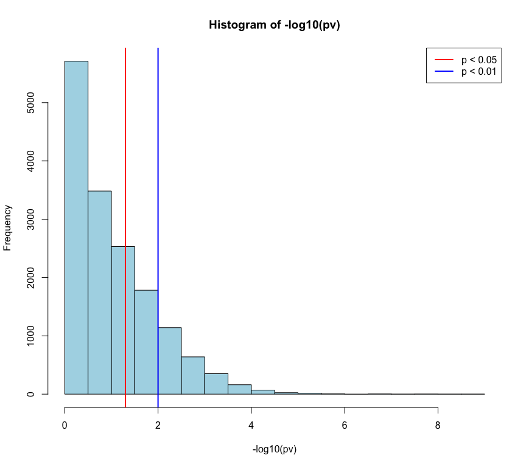
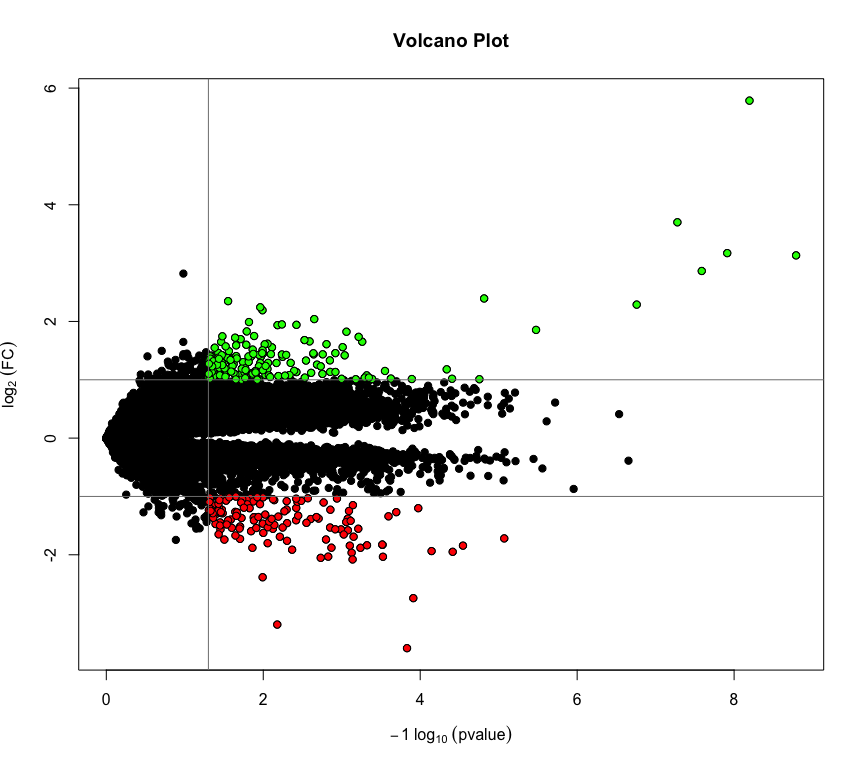

------------------------------------------------------------------------

#### In this lab, we will be conducting a two-sample test for each gene/probe on the array to identify differentially expressed genes/probes between ketogenic rats and control diet rats. This small data set was run on the rat RAE230A Affymetrix array. The objective of the study was to determine differences in mRNA levels between brain hippocampi of animals fed a ketogenic diet (KD) and animals fed a control diet. “KD is an anticonvulsant treatment used to manage medically intractable epilepsies”, so differences between the 2 groups of rats can provide biological insight into the genes that are regulated due to the treatment.

#### We are going to identify those genes/probes that are differentially expressed between the 2 rat diet groups and plot the results with a couple of different visual summaries.

#### **1.) Download the GEO rat ketogenic brain data set and save as a text file.**


```r
# "rat_KD.zip" downloaded from Data sets section in course
# Decompress the zip files into a data directory
system("unzip -o ./data/rat_KD.zip -d ./data/")

# Check to make sure the unzip process went well
dir("data/")
```

```
## [1] "probes.txt" "rat_KD.txt" "rat_KD.zip"
```

#### **2.) Load into R, using `read.table()` function and `header=T`, `row.names=1` arguments.**


```r
# Read data into R as "dat"
dat <- read.table(file = "data/rat_KD.txt",
                  header = TRUE,
                  row.names = 1)

# Check out the data structure
str(dat)
```

```
## 'data.frame':	15923 obs. of  11 variables:
##  $ control.diet.19300  : num  76.4 94.7 27.9 174.3 87 ...
##  $ control.diet.19301  : num  86.1 73.4 44.5 151.8 94 ...
##  $ control.diet.19302  : num  80.6 88.7 33.9 167.4 120.3 ...
##  $ control.diet.19303  : num  93.8 111.6 60 200.5 114.6 ...
##  $ control.diet.19304  : num  73.1 92.1 39.2 170.7 100.2 ...
##  $ control.diet.19305  : num  97.7 96.4 37.6 196.8 88.4 ...
##  $ ketogenic.diet.19306: num  82.5 131.3 42.8 192.1 122.4 ...
##  $ ketogenic.diet.19307: num  77.2 114.9 50.1 206.3 131 ...
##  $ ketogenic.diet.19308: num  120.2 156.7 78.2 236 157.4 ...
##  $ ketogenic.diet.19309: num  99 117.2 47.9 202.8 110.4 ...
##  $ ketogenic.diet.19310: num  88.3 119.6 37 185.8 117.7 ...
```

In the data, there appears to be **6 control diet** samples and **5 ketogenic diet** samples.

#### **3.) First $log_2$ the data, then use the Student’s t-test function in the notes to calculate the changing genes between the control diet and ketogenic diet classes. (Hint: use the `names()` function to determine where one class ends and the other begins).**


```r
# log transform the data
log2.dat <- log2(dat)

# function from lecture notes
t.test.all.genes <- function(x,s1,s2) {
        x1 <- x[s1]; x2 <- x[s2]
        x1 <- as.numeric(x1); x2 <- as.numeric(x2)
        t.out <- t.test(x1,x2, alternative="two.sided",var.equal=T)
        out <- as.numeric(t.out$p.value)
        return(out)
}

# gather indices of the groups
control <- grep("control", names(log2.dat))
keto <- grep("ketogenic", names(log2.dat))

# get p-values
pv <- apply(log2.dat, 1, t.test.all.genes, s1 = control, s2 = keto)
```

#### **4.) Plot a histogram of the p-values and report how many probesets have a p<.05 and p<.01. Then divide an alpha of 0.05 by the total number of probesets and report how many probesets have a p-value less than this value. This is a very conservative p-value thresholding method to account for multiple testing called the Bonferroni correction that we will discuss in upcoming lectures.**


```r
# Plot histogram of p-values
hist(-log10(pv), col = "lightblue")
abline(v = c(-log10(0.05), -log10(0.01)),
       col = c("red", "blue"), lwd = 2)
legend(
    x = "topright",
    legend = c("p < 0.05", "p < 0.01"),
    col = c("red", "blue"), lty = 1, lwd = 2
)
```



```r
# How many genes have p-values below alpha threshholds 0.05 and 0.01, respectively?
(lt0.05 <- sum(pv < 0.05))
```

```
## [1] 5160
```

```r
(lt0.01 <- sum(pv < 0.01))
```

```
## [1] 2414
```

```r
# Bonferroni corrected alpha
nProbesets <- length(names(pv))
bf.alpha <- 0.05/nProbesets

# How many are below this corrected alpha value?
(pv.sig <- sum(pv < bf.alpha))
```

```
## [1] 12
```

Although **5160** probesets have p-values calculated to be below 0.05 and **2414** probesets appear to have p-values below 0.01, we need to account for the problem of multiple comparisons. Since we make 15923 separate comparisons to get all our p-values, we need to correct this potential source of error. After performing a conservative Bonferroni correction, we see that in actuality, only **12** probesets can be regarded as *likely* significant (below the corrected threshold p-value).

#### **5.) Next calculate the mean for each gene, and calculate the fold change between the groups (control vs. ketogenic diet). Remember that you are on a log2 scale.**


```r
# mean of each gene in control sample
control.m <- apply(log2.dat[,control], 1, mean, na.rm = TRUE)

# mean of each gene in keto sample
keto.m <- apply(log2.dat[,keto], 1, mean, na.rm = TRUE)

# fc of all genes
log2fc <- control.m - keto.m
```

#### **6.) What is the maximum and minimum fold change value, please report on the linear scale? Now report the probesets with a p-value less than the Bonferroni threshold you used in question 4 and |fold change|>2. Remember that you are on a log2 scale for your fold change and I am looking for a linear |fold| of 2.**

To transpose the fold change, we will return it to the exponential with the following equation: $log_b (M) = N$ --> $M = b^N$. So, by raising 2 to the power of each $log_2FC$ value, we obtain the non-transformed fold change.


```r
# Linear scale FC
fc <- 2^(log2fc)
# Minimum and maximum values
min(fc)
```

```
## [1] 0.08240443
```

```r
max(fc)
```

```
## [1] 55.15521
```

```r
# Linear scale the subset of probesets with |log2fc| > 2
(filt.fc <- 2^log2fc[(abs(log2fc) > 2)])
```

```
## 1367553_x_at   1387011_at   1387408_at 1387696_a_at 1387827_x_at   1370239_at 
##   9.00836617   5.25583892   0.19138963   0.24414227   7.06296231  12.99360895 
## 1370240_x_at 1371102_x_at 1371245_a_at   1371272_at   1388358_at 1388608_x_at 
##   8.76945002   7.28482038  55.15521320   5.09128353   0.10909850   4.88586193 
##   1372087_at   1388804_at   1373938_at   1374132_at   1375213_at   1375608_at 
##   0.23652737   0.24107415   0.24457633   4.56923312   0.14933507   4.11397625 
##   1375758_at   1394198_at 
##   0.08240443   4.73212583
```

```r
# Get probesets whose p-value is less than Bonferroni alpha
(filt.pv <- pv[pv < bf.alpha])
```

```
## 1367553_x_at   1368071_at   1370239_at 1370240_x_at   1370355_at 1371102_x_at 
## 1.224053e-08 1.108599e-06 5.280180e-08 1.622293e-09 1.909314e-06 2.583221e-08 
## 1371245_a_at 1388608_x_at   1373040_at   1374641_at   1390092_at   1376005_at 
## 6.370531e-09 1.743055e-07 2.773686e-06 2.217421e-07 2.450007e-06 2.919439e-07
```

```r
# Find probeset names which appear in filt.fc and pv < bf.alpha sets
lt_bf  <- intersect(names(filt.fc), names(filt.pv))

# Subset by those probeset names
bf.filt.fc <- filt.fc[lt_bf]
names(bf.filt.fc)
```

```
## [1] "1367553_x_at" "1370239_at"   "1370240_x_at" "1371102_x_at" "1371245_a_at"
## [6] "1388608_x_at"
```

```r
# Write file of probesets to upload to DAVID
write.table(
    names(bf.filt.fc),
    file = "data/probes.txt",
    quote = FALSE,
    row.names = FALSE,
    col.names = FALSE
)
```

There are 6 probesets with **both** a $|FC| > 2$ and $p < 3.14 \times 10^{-6}$ (Bonferroni-corrected alpha).

#### **7.) Go to NetAffx or another database source if you like and identify gene information for the probesets that came up in #6. What is the general biological function that associates with these probesets?**


As seen in the results above all of the probe-sets are involved in:

- Cellular Component: **hemoglobin complex ([GO:0005833][1])**

- Biological Process: **oxygen transport ([GO:0015671][2])**

- Molecular Functions: **oxygen transporter activity ([GO:0005344][3]), iron ion binding ([GO:0005506][4]), oxygen binding ([GO:0019825][5]), heme binding ([GO:0020037][6])**

To re-create, upload `probes.txt` to the [DAVID tool][0], select "AFFYMETRIX_3PRIME_IVT_ID" as the identifier, and check "Gene List" as the list type. Then, click the "Functional Annotation Table" on the bottom of the page to retrieve the table pictured above (as of 08 July 2021).


#### **8.) Transform the p-value (-1*log10(p-value)) and create a volcano plot with the p-value and fold change vectors (see the lecture notes). Make sure to use a log10 transformation for the p-value and a log2 (R function log2()) transformation for the fold change. Draw the horizontal lines at fold values of 2 and -2 (log2 value=1) and the vertical p-value threshold line at p=.05 (remember that it is transformed in the plot).**


```r
p.trans <- -1*log10(pv)
plot(
    range(p.trans),
    range(log2fc),
    type = "n",
    main = "Volcano Plot",
    xlab = expression(-1*~log[10]~(pvalue)),
    ylab = expression(log[2]~(FC))
)
points(p.trans, log2fc,
       pch = 21, col = "black", bg = "black")
points(p.trans[(p.trans > -log10(.05) &
                    log2fc > log2(2))],
       log2fc[(p.trans > -log10(.05) &
                   log2fc > log2(2))],
       pch = 21, col = "black", bg = "green")
points(p.trans[(p.trans > -log10(.05) &
                    log2fc < -log2(2))],
       log2fc[(p.trans > -log10(.05) &
                   log2fc < -log2(2))],
       pch = 21, col = "black", bg = "red")
abline(v = -log10(0.05), h = c(log2(2), -log2(2)), col = "grey50")
```



<!-- Sources -->
[0]: https://david.abcc.ncifcrf.gov/tools.jsp
[1]: https://www.ebi.ac.uk/QuickGO/GTerm?id=GO:0005833
[2]: https://www.ebi.ac.uk/QuickGO/GTerm?id=GO:0015671
[3]: https://www.ebi.ac.uk/QuickGO/GTerm?id=GO:0005344
[4]: https://www.ebi.ac.uk/QuickGO/GTerm?id=GO:0005506
[5]: https://www.ebi.ac.uk/QuickGO/GTerm?id=GO:0019825
[6]: https://www.ebi.ac.uk/QuickGO/GTerm?id=GO:0020037
