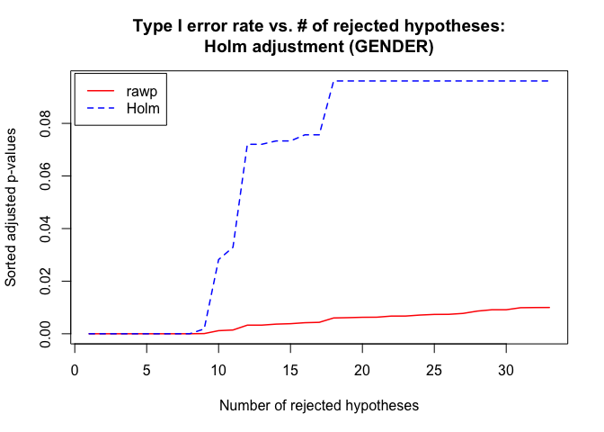
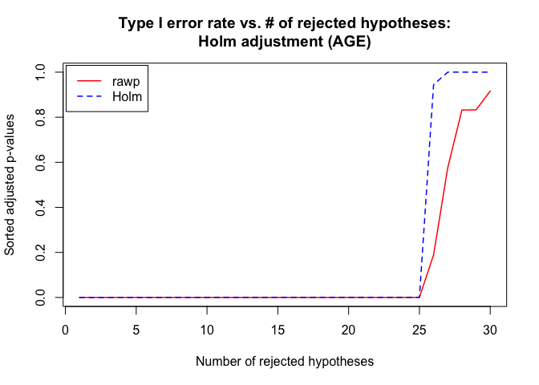
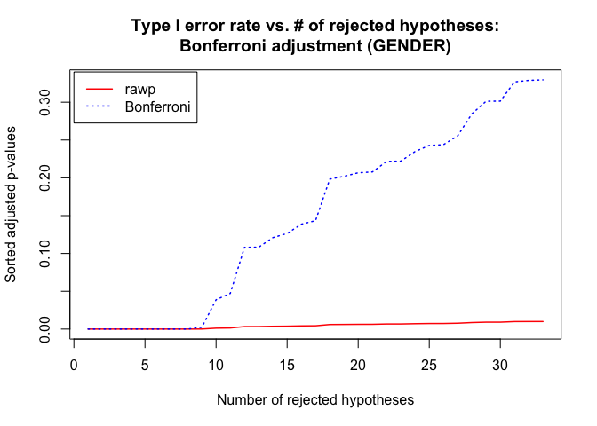
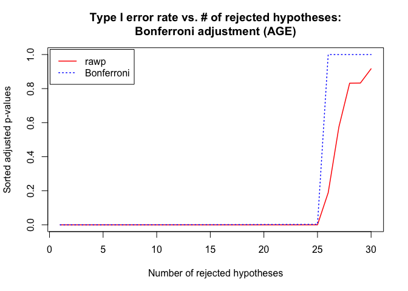
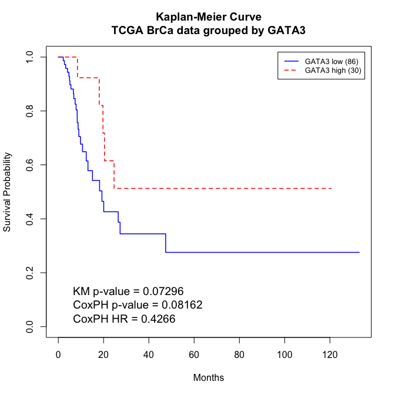

------------------------------------------------------------------------


#### In this lab, we will be working with an Affymetrix data set that was run on the human HGU95A array. This experiment was designed to assess the gene expression events in the frontal cortex due to aging. A total of 18 male and 12 female postmortem brain samples were obtained to assess this.

#### The analysis that we are interested in conducting is a direct follow up to the previous lab of differential expression. We first want to identify those genes/probes that are differentially expressed in the frontal cortex between old and young subjects, then between males and females. Next, we would like to evaluate the differences between a couple of multiple testing adjustment methods. As explained in the lecture and the course website, multiple testing is a necessary step to reduce false positives when conducting more than a single statistical test. You will generate some p-value plots to get an idea of the how conservative some methods are compared to others.

#### I have identified 2 gene vectors for you to use below, so do not calculate the t-test or adjustments on the entire array of genes/probes.

------------------------------------------------------------------------

#### 0.) Load necessary libraries for the document.
 

```r
source("scripts/t.test.all.genes.R")
suppressPackageStartupMessages(library(multtest))
suppressPackageStartupMessages(library(survival))
```

#### 1.) Download the GEO Brain Aging study from the class website. Also obtain the annotation file for this data frame.
 

```r
dir("./data")
```

```
## [1] "agingStudy11FCortexAffy.txt"   "agingStudy11FCortexAffy.zip"  
## [3] "agingStudy1FCortexAffyAnn.txt" "agingStudy1FCortexAffyAnn.zip"
## [5] "tcga_brca_fpkm_sam.txt"        "tcga_brca_fpkm_sam.zip"       
## [7] "tcga_brca_fpkm.txt"            "tcga_brca_fpkm.zip"
```

#### 2.) Load into R, using `read.table()` function and the `header=T`, `row.names=1` arguments for each data file.
 

```r
brain.dat <- read.table(file = "data/agingStudy11FCortexAffy.txt",
                        header = TRUE,
                        row.names = 1)

brain.ann <- read.table(file = "data/agingStudy1FCortexAffyAnn.txt",
                        header = TRUE,
                        row.names = 1)
```

#### 3.) Prepare 2 separate vectors for comparison. The first is a comparison between male and female patients. The current data frame can be left alone for this, since the males and females are all grouped together. The second vector is comparison between patients >= 50 years of age and those < 50 years of age.

#### To do this, you must use the annotation file and logical operators to isolate the correct arrays/samples.
 

```r
# Vector of male patients
male <- brain.ann$Gender == "M"

# Vector of patients >= 50 y.o.
over50 <- brain.ann$Age >= 50
```

#### 4.) Run the t.test function from the notes using the first gene vector below for the gender comparison. Then use the second gene vector below for the age comparison. Using these p-values, use either p.adjust in the base library or mt.rawp2adjp in the multtest library to adjust the values for multiple corrections with the Holm's method.
 

```r
# gene of interest vectors (gender and age, respectively)
g.g <- c(1394, 1474, 1917, 2099, 2367, 2428, 2625, 3168, 3181, 3641, 
         3832, 4526, 4731, 4863, 6062, 6356, 6684, 6787, 6900, 7223, 
         7244, 7299, 8086, 8652, 8959, 9073, 9145, 9389, 10219, 11238, 
         11669, 11674, 11793)
g.a <- c(25, 302, 1847, 2324, 246, 2757, 3222, 3675, 4429, 4430, 
         4912, 5640, 5835, 5856, 6803, 7229, 7833, 8133, 8579, 8822, 
         8994, 10101, 11433, 12039, 12353, 12404, 12442, 67, 88, 100)

# raw p-values
rawp_gend <- apply(brain.dat[g.g, ], 1, t.test.all.genes, male, !male)
rawp_age <- apply(brain.dat[g.a, ], 1, t.test.all.genes, over50, !over50)

# adjusted p-values
mt.gend <- mt.rawp2adjp(rawp_gend, proc = "Holm")
mt.age <- mt.rawp2adjp(rawp_age, proc = "Holm")
```

#### 5.) Sort the adjusted p-values and non-adjusted p-values and plot them vs. the x-axis of numbers for each comparison data set. Make sure that the two lines are different colors. Also make sure that the p-values are sorted before plotting.
 

```r
### PLOT 1 FOR GENDER
gend.holm <- data.frame(mt.gend$adjp[order(mt.gend$index), ])
mt.plot(
    gend.holm,
    plottype = "pvsr",
    proc = colnames(gend.holm),
    leg = c(0, 0.099),
    lty = c(1:2),
    lwd = 1.5,
    col = c("red", "blue"),
    main = "Type I error rate vs. # of rejected hypotheses:\nHolm adjustment (GENDER)"
)
```



```r
### PLOT 1 FOR AGE
age.holm <- mt.age$adjp[order(mt.age$index), ]
mt.plot(
    age.holm,
    plottype = "pvsr",
    proc = colnames(age.holm),
    leg = c(0.05, 1.03),
    lty = c(1:2),
    lwd = 1.5,
    col = c("red", "blue"),
    main = "Type I error rate vs. # of rejected hypotheses:\nHolm adjustment (AGE)"
)
```



**Clearly, the threshold for hypothesis rejection by the Holm adjustment demonstrates that more false positives were present in the *gender* subset than in the *age* subset. This seems logical, too. Differences in the frontal cortex of patients are most likely to arise as a result of age rather than gender, so we are more likely to see false positives in the "significant" set of genes found in the gender set.**

#### 6.) Repeat #4 and #5 with the Bonferroni method.


```r
# Repeat adjustment
mt.gend <- mt.rawp2adjp(rawp_gend, proc = "Bonferroni")
mt.age <- mt.rawp2adjp(rawp_age, proc = "Bonferroni")

### PLOT 2 FOR GENDER
gend.bonf <- mt.gend$adjp[order(mt.gend$index), ]
mt.plot(
    gend.bonf,
    plottype = "pvsr",
    proc = colnames(gend.bonf),
    leg = c(0, 0.34),
    lty = c(1,3),
    lwd = 1.5,
    col = c("red", "blue"),
    main = "Type I error rate vs. # of rejected hypotheses:\nBonferroni adjustment (GENDER)"
)
```



```r
### PLOT 2 FOR AGE
age.bonf <- mt.age$adjp[order(mt.age$index), ]
mt.plot(
    age.bonf,
    plottype = "pvsr",
    proc = colnames(age.bonf),
    leg = c(0.05, 1.03),
    lty = c(1,3),
    lwd = 1.5,
    col = c("red", "blue"),
    main = "Type I error rate vs. # of rejected hypotheses:\nBonferroni adjustment (AGE)"
)
```



**The same trend holds for the Bonferroni adjustment, though it is much more stringent compared to the Holm adjustment.**

#### For the second part of this lab, you will be working with RNA-sequencing data from The Cancer Genome Atlas (TCGA), specifically a breast invasive carcinoma dataset of 119 patient tumors. The data matrix and annotation files are on the course website. We will be trying to confirm an observation from a meta-analysis performed by Mehra et al, 2005 in Cancer Research. The authors identified the gene (using arrays) and protein (using immunohistochemistry) GATA3 as a prognostic factor in breast cancer, where patients with low expression of GATA3 experienced overall worse survival. The PubMed abstract is here:

> GATA binding protein 3 (GATA3) is a transcriptional activator highly expressed by the luminal epithelial cells in the breast. Here we did a meta-analysis of the available breast cancer cDNA data sets on a cohort of 305 patients and found that GATA3 was one of the top genes with low expression in invasive carcinomas with poor clinical outcome. To validate its prognostic utility, we did a tissue microarray analysis on a cohort of 139 consecutive invasive carcinomas (n = 417 tissue samples) immunostained with a monoclonal antibody against GATA3. Low GATA3 expression was associated with higher histologic grade (P < 0.001), positive nodes (P = 0.002), larger tumor size (P = 0.03), negative estrogen receptor and progesterone receptor (P < 0.001 for both), and HER2-neu overexpression (P = 0.03). Patients whose tumors expressed low GATA3 had significantly shorter overall and disease-free survival when compared with those whose tumors had high GATA3 levels. The hazard ratio of metastasis or recurrence according to the GATA3 status was 0.31 (95% confidence interval, 0.13-0.74; P = 0.009). Cox multivariate analysis showed that GATA3 had independent prognostic significance above and beyond conventional variables. Our data suggest that immunohistochemical analysis of GATA3 may be the basis for a new clinically applicable test to predict tumor recurrence early in the progression of breast cancer. ([source](http://www.ncbi.nlm.nih.gov/pubmed/16357129))

------------------------------------------------------------------------

#### 7.) Read in the log2 normalized fragments per kb per million mapped reads (FPKM) data matrix and annotation files. This is RNA-sequencing data that has normalized read counts on a similar scale to microarray intensities.


```r
tcga.dat <- read.table(file = "data/tcga_brca_fpkm.txt",
                       header = TRUE,
                       row.names = 1,
                       sep = "\t")

tcga.ann <- read.table(file = "data/tcga_brca_fpkm_sam.txt",
                       header = TRUE,
                       row.names = 1,
                       sep = "\t")
```

#### 8.) Use `grep` to subset the data matrix only by gene ‘GATA3’ and make sure to cast this vector to numeric.


```r
gata3 <- grep("GATA3", rownames(tcga.dat))
tcga.dat.gata3 <- as.numeric(tcga.dat[gata3, ])
```

#### 9.) Create a binary (1/0) vector for the patients where the upper 25% expression of GATA3 is coded as 1 and all other patients are coded as 0. Call this new variable `group`.


```r
# We're only interested in the 75th percentile (upper 25%)
upper25th <- quantile(tcga.dat.gata3, prob = 0.75)

# Vectorize necessary variables to isolate them for a data frame
time <- as.numeric(tcga.ann$months_to_event)
status <- as.numeric(tcga.ann$vital_status == "DECEASED")
group <- as.numeric(tcga.dat.gata3 >= upper25th)
```

#### 10.) Create a data matrix with the `group` variable you created in #9 and the remaining variables in the annotation file.


```r
ann.dm <- data.frame(time, status, group)
```

#### 11.) Run a Kaplan-Meier (KM) analysis to determine if a difference in survival experience exists between the two GATA3 expression groups using the survdiff function. Extract the p-value from the chi squared test output.


```r
surv <- with(ann.dm, Surv(time, status))
(sdf <- survdiff(surv ~ group, data = ann.dm))
```

```
## Call:
## survdiff(formula = surv ~ group, data = ann.dm)
## 
## n=116, 3 observations deleted due to missingness.
## 
##          N Observed Expected (O-E)^2/E (O-E)^2/V
## group=0 86       27    22.39     0.951      3.22
## group=1 30        5     9.61     2.214      3.22
## 
##  Chisq= 3.2  on 1 degrees of freedom, p= 0.07
```

```r
# Extract p-value from chi-squared
pval_km <- signif(pchisq(sdf$chisq, length(sdf$n) - 1, lower.tail = FALSE), 4)
```

#### 12.) Now run a Cox proportion hazard (PH) regression model on just the grouping variable (i.e. no other covariates) and extract both the p-value and hazard ratio from the output.


```r
cph <- coxph(surv ~ group, data = ann.dm)
summary(cph)
```

```
## Call:
## coxph(formula = surv ~ group, data = ann.dm)
## 
##   n= 116, number of events= 32 
##    (3 observations deleted due to missingness)
## 
##          coef exp(coef) se(coef)      z Pr(>|z|)  
## group -0.8520    0.4266   0.4893 -1.741   0.0816 .
## ---
## Signif. codes:  0 '***' 0.001 '**' 0.01 '*' 0.05 '.' 0.1 ' ' 1
## 
##       exp(coef) exp(-coef) lower .95 upper .95
## group    0.4266      2.344    0.1635     1.113
## 
## Concordance= 0.596  (se = 0.026 )
## Likelihood ratio test= 3.63  on 1 df,   p=0.06
## Wald test            = 3.03  on 1 df,   p=0.08
## Score (logrank) test = 3.22  on 1 df,   p=0.07
```

```r
# Extract p-value and hazard ratio
pval_cox <- signif(summary(cph)$coefficients[5], 4)
HR_cox <- signif(summary(cph)$coefficients[2], 4)
```

#### 13.) Run the `survfit()` function only on the grouping variable (i.e. no other covariates) and plot the KM curves, being sure to label the two groups with a legend, two different colors for each line, and provide the KM p-value, Cox PH p-value, Cox PH hazard ratio, and sample sizes all in each of the two groups all on the plot.


```r
# Survival fit
sf <- survfit(surv ~ group, data = ann.dm)

# Plot data
plot(
    sf,
    lty = 1:2,
    lwd = 1.5,
    col = c("blue", "red"),
    xlab = "Months",
    ylab = "Survival Probability",
    main = "Kaplan-Meier Curve\nTCGA BrCa data grouped by GATA3"
)

# Line legend with sample sizes
legend(
    x = "topright",
    legend = c(
        paste0("GATA3 low (", sf$n[[1]], ")"),
        paste0("GATA3 high (", sf$n[[2]], ")")
    ),
    col = c("blue", "red"),
    lwd = 1.5,
    lty = c(1, 2),
    inset = 0.02,
    cex = 0.8
)

# Statistics text box
legend(
    x = "bottomleft",
    legend = c(
        paste0("KM p-value = ", pval_km),
        paste0("CoxPH p-value = ", pval_cox),
        paste0("CoxPH HR = ", HR_cox)
    ),
    inset = 0.02,
    bty = "n",
    cex = 1.2
)
```



#### 14.) Does this result agree with the *Mehra et al*, study result?

Yes, this does agree with the result in the *Mehra et al* study. Although the p-value doesn't indicate significance, there is a general trend that patients with higher GATA3 expression levels have favorable survival. In fact, these patients are approximately 40% as likely to die from their breast cancer (HR = 0.4266).

# Function sourced
  

```r
# Function used to generate raw p-values
t.test.all.genes
```

```
## function (x, s1, s2) 
## {
##     x1 <- x[s1]
##     x2 <- x[s2]
##     x1 <- as.numeric(x1)
##     x2 <- as.numeric(x2)
##     t.out <- t.test(x1, x2, alternative = "two.sided", var.equal = T)
##     out <- as.numeric(t.out$p.value)
##     return(out)
## }
## <bytecode: 0x7f8981d89ed0>
```

# Session info
  

```r
sessionInfo()
```

```
## R version 4.1.0 (2021-05-18)
## Platform: x86_64-apple-darwin17.0 (64-bit)
## Running under: macOS Big Sur 10.16
## 
## Matrix products: default
## BLAS:   /Library/Frameworks/R.framework/Versions/4.1/Resources/lib/libRblas.dylib
## LAPACK: /Library/Frameworks/R.framework/Versions/4.1/Resources/lib/libRlapack.dylib
## 
## locale:
## [1] en_US.UTF-8/en_US.UTF-8/en_US.UTF-8/C/en_US.UTF-8/en_US.UTF-8
## 
## attached base packages:
## [1] parallel  stats     graphics  grDevices utils     datasets  methods  
## [8] base     
## 
## other attached packages:
## [1] survival_3.2-11     multtest_2.48.0     Biobase_2.52.0     
## [4] BiocGenerics_0.38.0
## 
## loaded via a namespace (and not attached):
##  [1] knitr_1.33        magrittr_2.0.1    splines_4.1.0     MASS_7.3-54      
##  [5] lattice_0.20-44   R6_2.5.0          rlang_0.4.11      highr_0.9        
##  [9] stringr_1.4.0     tools_4.1.0       grid_4.1.0        xfun_0.24        
## [13] jquerylib_0.1.4   htmltools_0.5.1.1 yaml_2.2.1        digest_0.6.27    
## [17] Matrix_1.3-4      codetools_0.2-18  sass_0.4.0        evaluate_0.14    
## [21] rmarkdown_2.9     stringi_1.6.2     compiler_4.1.0    bslib_0.2.5.1    
## [25] stats4_4.1.0      jsonlite_1.7.2
```

