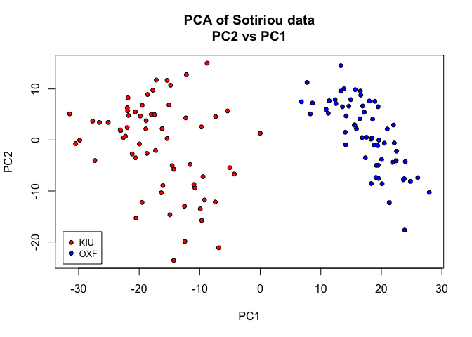
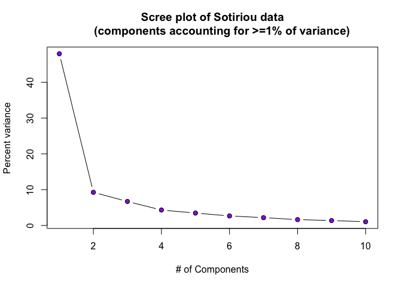
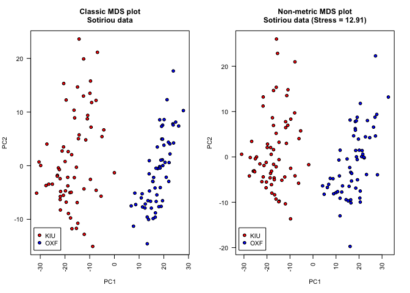
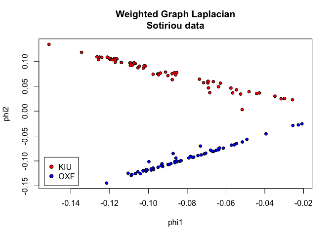

# Lab 7 - Dimensionality Reduction
Ryan Yancey, 29 July 2021


---


#### In this lab, we will be using an Affymetrix breast cancer data set that was run on the **human HGU133A array**. In the study, the investigators were interested in identifying transcripts that were differentially expressed in different histologic grade tumor samples to evaluate whether gene expression profiling could be used to improve histologic grading. Our interest in this data set does not focus on this same biological question. Rather, we would like to assess the processing variability in the data, since this type of variability can many times confound the biological variability.


#### Since the array data was generated at different sites, we are interested in how this factor affects the variability in the samples. Specifically, we would like to use dimensionality reduction (DR) methods to evaluate the amount of variance that is explained by differences in processing sites. You will compute 4 different DR methods on this data set with the objectives of 1) summarizing the amount of variability is explained by differences in processing sites, and 2) understanding the visual differences in how the data structure is embedded when using difference methods of DR.


#### The paper is entitled *Gene Expression Profi ling in Breast Cancer: Understanding the Molecular Basis of Histologic Grade To Improve Prognosis* and is available [here][1].


---


> **ABSTRACT**: Histologic grade in breast cancer provides clinically important prognostic information. However, 30% – 60% of tumors are classified as histologic grade 2. This grade is associated with an intermediate risk of recurrence and is thus not informative for clinical decision making. We examined whether histologic grade was associated with gene expression profiles of breast cancers and whether such profiles could be used to improve histologic grading.


---

**0.) Load necessary libraries/scripts for the homework.**


```r
library(MASS)
source("scripts/k.speClust2.R")
```


**1.) Load the *Sotiriou* breast cancer data set from the class website as well as the annotation file.**


```r
# Look at the directory where our data is stored
dir("data")
```

```
## [1] "sotiriou_annotations.txt" "sotiriou_data.txt"
```

```r
# Load data and annotation files with header/rownames set
dat <- read.table("data/sotiriou_data.txt",
                  header = TRUE,
                  row.names = 1)
ann <- read.table("data/sotiriou_annotations.txt",
                  header = TRUE,
                  row.names = 1)

# Make factor of "site" column
ann$site <- as.factor(ann$site)
str(ann)
```

```
## 'data.frame':	125 obs. of  13 variables:
##  $ site       : Factor w/ 2 levels "KIU","OXF": 1 1 1 1 1 1 1 1 1 1 ...
##  $ sample_name: chr  "KIU_101B88" "KIU_105B13" "KIU_106B55" "KIU_111B51" ...
##  $ treatment  : chr  "none" "none" "none" "none" ...
##  $ dataset    : chr  "KJ125" "KJ125" "KJ125" "KJ125" ...
##  $ grade      : int  3 1 1 3 3 2 2 3 2 2 ...
##  $ node       : int  0 0 0 0 0 0 0 0 0 0 ...
##  $ size       : num  1.2 1.3 6 3.3 3.2 1.6 2.1 2.2 2.8 1.7 ...
##  $ age        : int  40 46 37 41 38 34 46 57 63 54 ...
##  $ er         : int  0 1 1 1 1 1 1 1 1 1 ...
##  $ event.rfs  : int  0 0 1 1 1 0 1 1 1 1 ...
##  $ time.rfs   : num  6.247 7.329 1.167 0.499 3.082 ...
##  $ event.dmfs : int  0 0 0 1 1 0 1 1 1 0 ...
##  $ time.dmfs  : num  6.247 7.329 1.167 0.499 3.082 ...
```

**2.) Calculate and plot a PCA plot. Label the points based on the site (“site” column header in annotation file). Make sure to add a legend to denote the colors of the two sites.**


```r
# Principal component calculation
dat.pca <-prcomp(t(dat))
pcs <- dat.pca$x

# Plot PCA PC2 vs PC1
plot(
  pcs[, 2] ~ pcs[, 1],
  bg = c("red", "blue")[ann$site],
  pch = 21, cex = 0.8, xlab = "PC1", ylab = "PC2",
  main = "PCA of Sotiriou data\nPC2 vs PC1"
)

# Add legend to display factor and color
legend(
  "bottomleft", legend = levels(ann$site),
  pt.bg = c("red", "blue"),
  pch = 21, cex = 0.8, inset = 0.02
)
```




**3.) Calculate and plot the scree plot that corresponds to the PCA from question #2. Using only the first two eigenvalues, approximately how much variability in the data is explained?**


```r
# Get variation % of all eigenvalues
dat.pca.scree <- round(dat.pca$sdev^2 / sum(dat.pca$sdev^2) * 100, 2)

# Filter out those explaining less than 1% variance
dat.pca.scree <- dat.pca.scree[dat.pca.scree > 1]

# Scree plot
plot(
  x = 1:length(dat.pca.scree),
  y = dat.pca.scree,
  type = "b", pch = 21,
  bg = "purple",
  ylab = "Percent variance",
  xlab = "# of Components"
)
title("Scree plot of Sotiriou data
      (components accounting for >=1% of variance)")
```



```r
# Add up variance percent of first two eigenvalues
first2eigenvalues <- sum(dat.pca.scree[1:2])
```


The first two eigenvalues explain **57.21%** of the variance in this data.

**4.) Now calculate and plot 2 different MDS plots: 1) classic MDS and 2) nonmetric MDS. Label the points based on the site. Make sure to load the MASS library for the nonmetric MDS plot function. Also add a legend to both plots.**


```r
# Graphical parameters
par(mfrow = c(1, 2), cex = 0.64, las = 2)

# Distance matrix
dat.dist <- dist(t(dat))

# Classic MDS
dat.loc <- cmdscale(dat.dist)
plot(dat.loc[, 2] ~ dat.loc[, 1], xlab = "PC1", ylab = "PC2",
     pch = 21, bg = c("red", "blue")[ann$site],
     main = "Classic MDS plot\nSotiriou data")
legend("bottomleft", legend = levels(ann$site),
       inset = 0.02, pch = 21, pt.bg = c("red", "blue"))

# Non-metric MDS
dat.mds <- isoMDS(dat.dist, trace = FALSE)
plot(dat.mds$points[,2] ~ dat.mds$points[,1], xlab = "PC1", ylab = "PC2",
     pch = 21, bg = c("red", "blue")[ann$site],
     main = paste0("Non-metric MDS plot\nSotiriou data (Stress = ",
                   round(dat.mds$stress, 2), ")"))
legend("bottomleft", legend = levels(ann$site),
       inset = 0.02, pch = 21, pt.bg = c("red", "blue"))
```



**5.) Now, first center and scale the rows of the matrix with the commands below (assuming that dd is your data matrix):**


`temp <- t(dd); temp <- scale(temp, center=T, scale=T)`  


**Then calculate and plot a two-dimensional embedding of the weighted graph Laplacian using `t(temp)` as the `X` argument and `NULL` for the `qnt` argument (don’t use quotations to run the function). Label the points based on the site. Also add a legend.**


```r
# Scale and center the rows of our matrix
temp <- scale(t(dat), center = TRUE, scale = TRUE)

# Calculate/plot 2D embedding of weighted graph Laplacian
phi <- k.speClust2(X = t(temp))
plot(
  phi[, 2] ~ phi[, 1], pch = 21, cex = 0.8,
  xlab = "phi1", ylab = "phi2",
  bg = c("red", "blue")[ann$site],
  main="Weighted Graph Laplacian\nSotiriou data"
)
legend(
  "bottomleft", legend = levels(ann$site),
  inset = 0.02, pch = 21, pt.bg = c("red", "blue")
)
```



## Sourced scripts


```r
# k.speClust2() calculates the weighted graph Laplacian
k.speClust2
```

```
## function (X, qnt = NULL) 
## {
##     dist2full <- function(dis) {
##         n <- attr(dis, "Size")
##         full <- matrix(0, n, n)
##         full[lower.tri(full)] <- dis
##         full + t(full)
##     }
##     dat.dis <- dist(t(X), "euc")^2
##     if (!is.null(qnt)) {
##         eps <- as.numeric(quantile(dat.dis, qnt))
##     }
##     if (is.null(qnt)) {
##         eps <- min(dat.dis[dat.dis != 0])
##     }
##     kernal <- exp(-1 * dat.dis/(eps))
##     K1 <- dist2full(kernal)
##     diag(K1) <- 0
##     D = matrix(0, ncol = ncol(K1), nrow = ncol(K1))
##     tmpe <- apply(K1, 1, sum)
##     tmpe[tmpe > 0] <- 1/sqrt(tmpe[tmpe > 0])
##     tmpe[tmpe < 0] <- 0
##     diag(D) <- tmpe
##     L <- D %*% K1 %*% D
##     X <- svd(L)$u
##     Y <- X/sqrt(apply(X^2, 1, sum))
## }
## <bytecode: 0x7fc26cc3bb10>
```

## Session info


```r
sessionInfo()
```

```
## R version 4.1.0 (2021-05-18)
## Platform: x86_64-apple-darwin17.0 (64-bit)
## Running under: macOS Big Sur 10.16
## 
## Matrix products: default
## BLAS:   /Library/Frameworks/R.framework/Versions/4.1/Resources/lib/libRblas.dylib
## LAPACK: /Library/Frameworks/R.framework/Versions/4.1/Resources/lib/libRlapack.dylib
## 
## locale:
## [1] en_US.UTF-8/en_US.UTF-8/en_US.UTF-8/C/en_US.UTF-8/en_US.UTF-8
## 
## attached base packages:
## [1] stats     graphics  grDevices utils     datasets  methods   base     
## 
## other attached packages:
## [1] MASS_7.3-54
## 
## loaded via a namespace (and not attached):
##  [1] digest_0.6.27     R6_2.5.0          jsonlite_1.7.2    magrittr_2.0.1   
##  [5] evaluate_0.14     highr_0.9         rlang_0.4.11      stringi_1.6.2    
##  [9] jquerylib_0.1.4   bslib_0.2.5.1     rmarkdown_2.9     tools_4.1.0      
## [13] stringr_1.4.0     xfun_0.24         yaml_2.2.1        compiler_4.1.0   
## [17] htmltools_0.5.1.1 knitr_1.33        sass_0.4.0
```

<!-- sources -->
[1]: https://academic.oup.com/jnci/article/98/4/262/2521968
