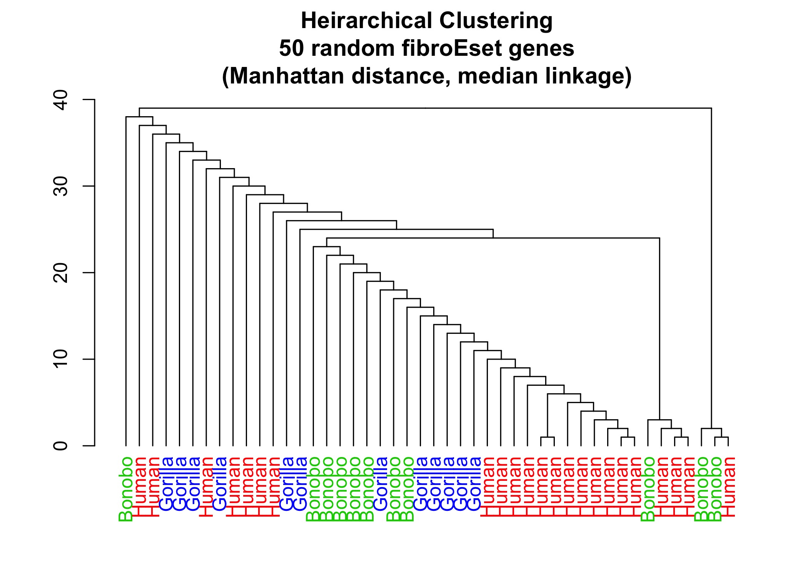
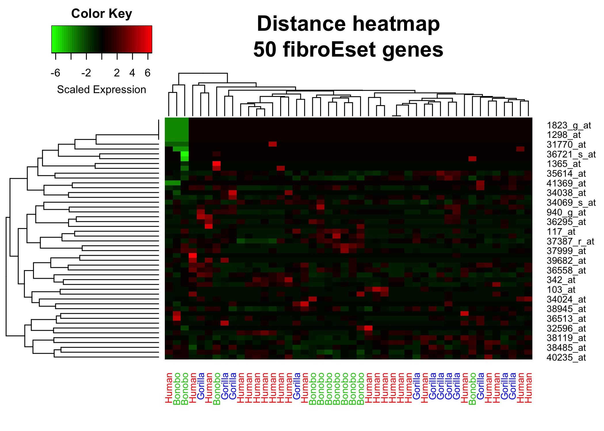
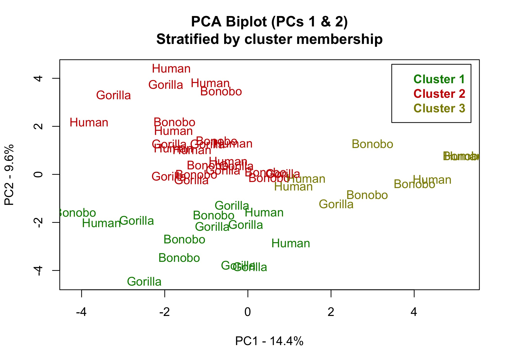

------------------------------------------------------------------------


#### In this lab, you will be working with an R data set that was run on the Affymetrix human HGU95Av2 array. The microarray data are from genomic primary fibroblast cell lines and were generated for 46 samples: 23 human (*Homo sapiens*), 11 bonobo (*Pan paniscus*), and 12 gorilla (*Gorilla gorilla*) donors. This is a publicly available dataset within the `fibroEset` package in R. It should be noted that two identical human donor arrays are in this dataset. This data set is good for clustering and classification problems since there is a large difference in transcript profiles between all 3 species.

#### The analysis that you will conduct is based on clustering methods. The first problems require hierarchical clustering, while the last problems use spectral k-means clustering. We denote this as ‘spectral’ because instead of using the genes/probes as input into the clustering algorithm like the hierarchical clustering method, some form of spectral decomposition (e.g. PCA) is first computed and these eigenfunctions are used in the clustering algorithm. This method can be more useful than using the genes/probes in some cases where the variability is best summarized in a few components (or eigenfunctions).

------------------------------------------------------------------------

**1.) Load the `fibroEset` library and data set. Obtain the classifications for the samples.**


```r
# Load necessary packages, quietly
suppressPackageStartupMessages(library(fibroEset))
suppressPackageStartupMessages(library(dendextend))
suppressPackageStartupMessages(library(gplots))
data("fibroEset")

# Extract necessary info
dat <- as.data.frame(exprs(fibroEset))
ann <- as.data.frame(pData(fibroEset))

# Add factor for long names for easy human reading
ann$species_long <- ann$species %>%
  factor(levels = c("b", "g", "h"), labels = c("Bonobo", "Gorilla", "Human"))

# Make sure columns are in the right order
dat <- dat[,ann$samp]

# Make columns human readable
colnames(dat) <- ann$species_long
```

---

**2.) Select a random set of 50 genes from the data frame, and subset the data frame.**


```r
# Set seed for reproducibility
set.seed(11)

# Sample 50 rows (genes)
random_set <- sample(nrow(dat), 50)
subset.dat <- dat[random_set, ]

# Make data similar in scale
subset.dat <- t(scale(t(subset.dat)))
```

---

**3.) Run and plot hierarchical clustering of the samples using manhattan distance metric and median linkage method. Make sure that the sample classification labels are along the x-axis. Title the plot.**


```r
# Distance and cluster
dist <- dist(t(subset.dat), method = "manhattan")
hclust.dat <- hclust(dist, method = "median")

# Set label colors based on species
label_cols <- c("green3", "blue", "red")[ann$species_long]

# Dendrogram and plot
hclust.dat %>% 
  as.dendrogram %>%
  rank_branches(.) %>%
  set("labels_color", label_cols[order.dendrogram(.)]) %>%
  plot(main = paste("Heirarchical Clustering", 
                    "50 random fibroEset genes",
                    "(Manhattan distance, median linkage)", sep = "\n"))
```



---

**4.) Now both run hierarchical clustering and plot the results in two dimensions (on samples and genes). Plot a heatmap with the genes on the y-axis and samples on the x-axis. Once again, make sure that the sample and genes labels are present. Title the plot.**


```r
# Heatmap colors
heat_colors <- colorRampPalette(c("green", "black", "red"))(50)

# A more involved heatmap plot
heatmap.2(as.matrix(subset.dat),
        main = paste("Distance heatmap\n50 fibroEset genes"),
        colCol = label_cols,
        density.info = "none",
        col = heat_colors,
        trace = "none",
        key.xlab = "Scaled Expression")
```



---

**5.) Calculate PCA on the samples and retain the first two components vectors (eigenfunctions). Calculate *k-means* clustering on these first two components with `k=3`.**


```r
# Calculate PCA, extract first 2 eigenvectors
pca <- prcomp(subset.dat)
pcs <- pca$x[,1:2]

# K-means clustering on these two components
km <- kmeans(pcs, centers = 3, iter.max = 20)

# Basic stats on PCA eigenvectors
summary(pca)[["importance"]][, 1:2]
```

```
##                             PC1      PC2
## Standard deviation     2.499956 2.038868
## Proportion of Variance 0.144480 0.096100
## Cumulative Proportion  0.144480 0.240580
```

---

**6.) Plot a two-dimensional scatter plot of the sample classification labels, embedded with the first two eigenfunctions (from PCA). Color the labels with the color that corresponds to the predicted cluster membership. Make sure to label the axes and title the plot.**


```r
# Proportion of variance
pct_var <- round(100*apply(pca$x, 2, var)/sum(apply(pca$x, 2, var)), 1)

# Plot PCA
plot(pcs[,2] ~ pcs[,1],
     type = "n",
     xlab = paste0("PC1 - ", pct_var[1], "%"), 
     ylab = paste0("PC2 - ", pct_var[2], "%"),
     main = "PCA Biplot (PCs 1 & 2)\nStratified by cluster membership")
text(pcs[,2] ~ pcs[,1],
     labels = levels(ann$species_long),
     col = c("green4", "red3", "yellow4")[km$cluster])
legend("topright", 
       legend = c("Cluster 1", "Cluster 2", "Cluster 3"),
       text.col = c("green4", "red3", "yellow4"),
       inset = 0.02,
       text.font = 2)
```



---

## Session info


```r
sessionInfo()
```

```
## R version 4.1.1 (2021-08-10)
## Platform: x86_64-apple-darwin17.0 (64-bit)
## Running under: macOS Big Sur 10.16
## 
## Matrix products: default
## BLAS:   /Library/Frameworks/R.framework/Versions/4.1/Resources/lib/libRblas.0.dylib
## LAPACK: /Library/Frameworks/R.framework/Versions/4.1/Resources/lib/libRlapack.dylib
## 
## locale:
## [1] en_US.UTF-8/en_US.UTF-8/en_US.UTF-8/C/en_US.UTF-8/en_US.UTF-8
## 
## attached base packages:
## [1] parallel  stats     graphics  grDevices utils     datasets  methods  
## [8] base     
## 
## other attached packages:
## [1] gplots_3.1.1        dendextend_1.15.1   fibroEset_1.34.0   
## [4] Biobase_2.52.0      BiocGenerics_0.38.0
## 
## loaded via a namespace (and not attached):
##  [1] highr_0.9          bslib_0.2.5.1      compiler_4.1.1     pillar_1.6.2      
##  [5] jquerylib_0.1.4    bitops_1.0-7       viridis_0.6.1      tools_4.1.1       
##  [9] digest_0.6.27      viridisLite_0.4.0  jsonlite_1.7.2     evaluate_0.14     
## [13] lifecycle_1.0.0    tibble_3.1.3       gtable_0.3.0       pkgconfig_2.0.3   
## [17] rlang_0.4.11       DBI_1.1.1          yaml_2.2.1         xfun_0.25         
## [21] gridExtra_2.3      stringr_1.4.0      dplyr_1.0.7        knitr_1.33        
## [25] caTools_1.18.2     gtools_3.9.2       generics_0.1.0     sass_0.4.0        
## [29] vctrs_0.3.8        tidyselect_1.1.1   grid_4.1.1         glue_1.4.2        
## [33] R6_2.5.0           fansi_0.5.0        rmarkdown_2.10     purrr_0.3.4       
## [37] ggplot2_3.3.5      magrittr_2.0.1     scales_1.1.1       htmltools_0.5.1.1 
## [41] ellipsis_0.3.2     assertthat_0.2.1   colorspace_2.0-2   KernSmooth_2.23-20
## [45] utf8_1.2.2         stringi_1.7.3      munsell_0.5.0      crayon_1.4.1
```
