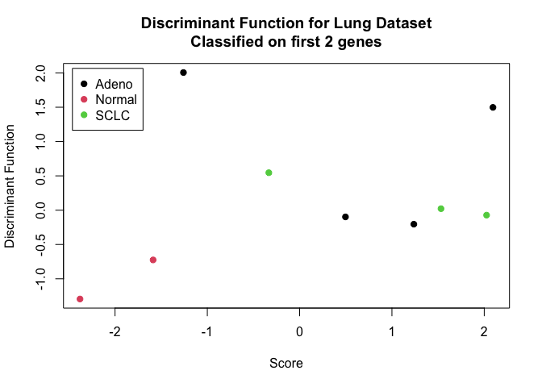
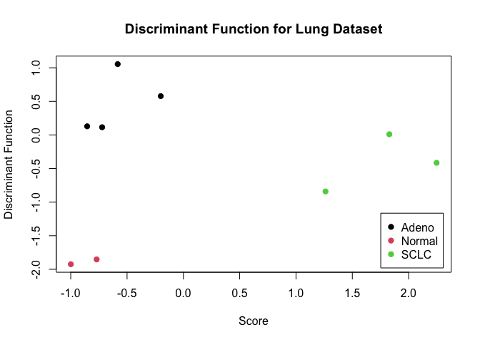

------------------------------------------------------------------------


#### In this lab, you will analyze an Affymetrix lung cancer data set that I have already preselected genes/probes. There are 3 different tissue types that gene expression information was generated for: small cell lung carcinoma (SCLC), adenocarcinoma, and normal healthy control. Like many microarray analysis studies in cancer, the investigators are interested in identifying transcripts that are both differentially expressed between different cancer types and normal tissue and can be subsequently used to classify unknown tissue into the appropriate cancer type.

#### For the analysis, you will calculate one of the classic classifier algorithms - linear discriminant analysis (LDA). The objective is to train a model on a subset of the arrays, then test the predictability of this model on the remaining arrays, for identifying the correct cancer (and normal) class. This type of classification problem is common in microarray analysis, when attempting to design a diagnostic or prognostic test based on transcripts.

------------------------------------------------------------------------

**1.) Obtain the GEO lung cancer data set from the course website and read in the data. The column headers explain what each sample type is.**


```r
# Read in the lung data
dat <- read.table(file = file.path("data", "lung_cancer.txt"), 
                  header = TRUE, 
                  row.names = 1)
dim(dat)
```

```
## [1] 3013   24
```

```r
names(dat)
```

```
##  [1] "Adeno1"  "Adeno2"  "Adeno3"  "Adeno4"  "Adeno5"  "Adeno6"  "Adeno7" 
##  [8] "Adeno8"  "Adeno9"  "Adeno10" "SCLC1"   "SCLC2"   "SCLC3"   "SCLC4"  
## [15] "SCLC5"   "SCLC6"   "SCLC7"   "SCLC8"   "SCLC9"   "Normal1" "Normal2"
## [22] "Normal3" "Normal4" "Normal5"
```

---

**2.) Load the `MASS` library and create a variable that has the class names for the 3 classes in the data. This variable should be of length 24. Next, bind the variable that you just created to a transposition of the data matrix using the `data.frame()` function. Note: the dimensions of this final data matrix should be 24 x 3014.**


```r
# Load the MASS library
library(MASS)

# Variable
dat.clas <- names(dat)
dat.clas[grep("Adeno", dat.clas)] <- "Adeno"
dat.clas[grep("SCLC", dat.clas)] <- "SCLC"
dat.clas[grep("Normal", dat.clas)] <- "Normal"

# Bind variable to transposition of matrix
dat.df <- data.frame(dat.clas, as.data.frame(t(dat)))
dim(dat.df)
```

```
## [1]   24 3014
```

---

**3.) Now create 2 separate data matrices from the matrix created in #2 above – a training set and a test set. The training set should include the following number of samples from each class: first 6 adenocarcinomas, first 6 SCLC, and first 3 normals. The test set should include the remaining samples. Put the first column of the test matrix that you just created into a new variable, since this will be the actual sample classes. Then remove the first column from the test set.**


```r
# Isolate the training set indices
train <- c(grep("^A", dat.clas)[1:6], 
           grep("^S", dat.clas)[1:6],
           grep("^N", dat.clas)[1:3])

# Subset train and test sets
train_set <- dat.df[train, ]
test_set <- dat.df[-train, ]

# Pull out indices
classes <- list(
  train = train_set[,1],
  test = test_set[,1]
)

# Remove from test
test_set <- test_set[,-1]
train_set <- train_set[,-1]
```

---

**4.) Now we want to run a classifier to see if we can predict the lung cancer types and discriminate them from both each other and the normal samples. We will train the model on the training set and use the test set as our model accuracy assessment.**

**Use the `lda()` function and train the model using the training set, but ONLY use the first 2 genes. Predict the test set sample using the `predict()` function. This function only requires 2 arguments – the variable that you saved the model construction in and the test set. Make sure to only select the first 2 genes (i.e. columns) in the test set, when predicting the sample classes. Use the `table()` function to see the confusion matrix. Hint: if you saved your output from the predict function in the variable “out” and you called the variable created in #3 “lab”, then you use table like this:**

> `table(out$class,lab)`

**How many total samples are misclassified?**


```r
# Train the model on the first two genes
dat.train <- lda(classes$train ~ ., train_set[,1:2])

# Test the model on the first two genes
dat.pred <- predict(dat.train, test_set[,1:2])

# How many are set into each class?
(tab <- table(dat.pred$class, classes$test))
```

```
##         
##          Adeno Normal SCLC
##   Adeno      1      1    1
##   Normal     0      1    0
##   SCLC       3      0    2
```

```r
correct <- sum(diag(tab)); incorrect <- sum(tab) - correct
```

**When training on the first two genes, 4 samples were classified correctly, meaning that 5 samples were incorrectly classified**

---

**5.) Now plot the first 2 discriminant functions versus each other in an xy plot. These vectors are saved in the object `x` from your `predict()` output. For example, if you used the following code to predict the samples:**

> `lda.test <- predict(lda.train,test[,1:2])`

**You can access the 2 vectors using:**

> `lda.test$x`

**Make sure to title the plot accordingly, color the points their appropriate cancer/normal type, and put a legend on the plot.** 


```r
# First two discriminant functions
plot(dat.pred$x, pch = 19, xlab = "Score",
     ylab = "Discriminant Function",
     col = as.numeric(factor(classes$test)),
     main = "Discriminant Function for Lung Dataset\nClassified on first 2 genes")
legend(
  "topleft",
  legend = levels(factor(classes$test)),
  pch = 19, col = 1:3, inset = 0.02
)
```



**Training a model on the first two genes doesn't give it enough predictive power to differentiate the three datasets.**

---

**6.) Now repeat #4 and #5 using all of the genes in the matrix as opposed to the first 2. Number 4 repeat.**


```r
# Train the model on all genes
train.lda.all <- lda(classes$train ~ ., train_set)
```

```
## Warning in lda.default(x, grouping, ...): variables are collinear
```

```r
# Test the model
test.lda.all <- predict(train.lda.all, test_set)

# How many are correctly classified?
(tab.all <- table(test.lda.all$class, classes$test))
```

```
##         
##          Adeno Normal SCLC
##   Adeno      4      0    0
##   Normal     0      2    0
##   SCLC       0      0    3
```

```r
correct.all <- sum(diag(tab.all)); incorrect.all <- sum(tab.all) - correct.all
```

**When training on all of the genes, 9 samples were classified correctly, meaning that 0 samples were incorrectly classified**

---

**7.) Number 5 repeat.**


```r
# First two discriminant functions
plot(test.lda.all$x, pch = 19, xlab = "Score",
     ylab = "Discriminant Function",
     col = as.numeric(factor(classes$test)),
     main = "Discriminant Function for Lung Dataset")
legend(
  "bottomright",
  legend = levels(factor(classes$test)),
  pch = 19, col = 1:3, inset = 0.02
)
```



**Training a model on *all* of the genes gives it enough predictive power to differentiate the three datasets.**

---

## Session info


```r
sessionInfo()
```

```
## R version 4.1.1 (2021-08-10)
## Platform: x86_64-apple-darwin17.0 (64-bit)
## Running under: macOS Big Sur 10.16
## 
## Matrix products: default
## BLAS:   /Library/Frameworks/R.framework/Versions/4.1/Resources/lib/libRblas.0.dylib
## LAPACK: /Library/Frameworks/R.framework/Versions/4.1/Resources/lib/libRlapack.dylib
## 
## locale:
## [1] en_US.UTF-8/en_US.UTF-8/en_US.UTF-8/C/en_US.UTF-8/en_US.UTF-8
## 
## attached base packages:
## [1] stats     graphics  grDevices utils     datasets  methods   base     
## 
## other attached packages:
## [1] MASS_7.3-54
## 
## loaded via a namespace (and not attached):
##  [1] digest_0.6.27     R6_2.5.0          jsonlite_1.7.2    magrittr_2.0.1   
##  [5] evaluate_0.14     highr_0.9         rlang_0.4.11      stringi_1.7.3    
##  [9] jquerylib_0.1.4   bslib_0.2.5.1     rmarkdown_2.10    tools_4.1.1      
## [13] stringr_1.4.0     xfun_0.25         yaml_2.2.1        compiler_4.1.1   
## [17] htmltools_0.5.1.1 knitr_1.33        sass_0.4.0
```
